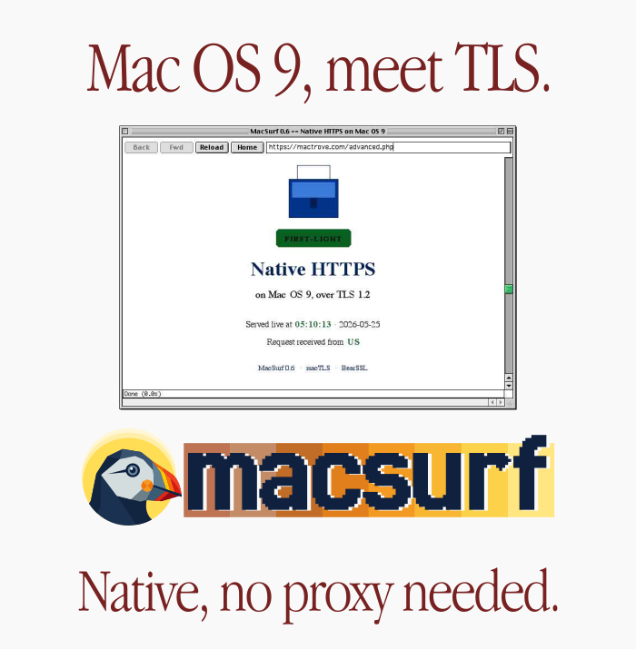
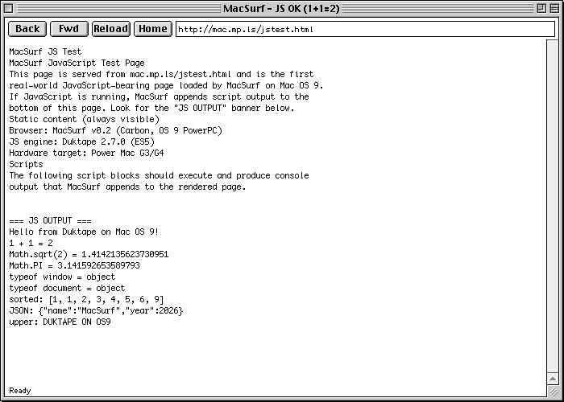
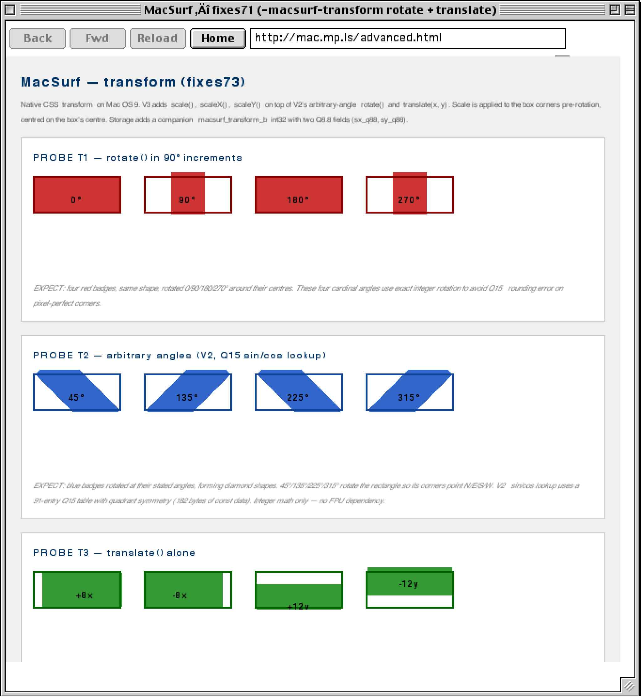
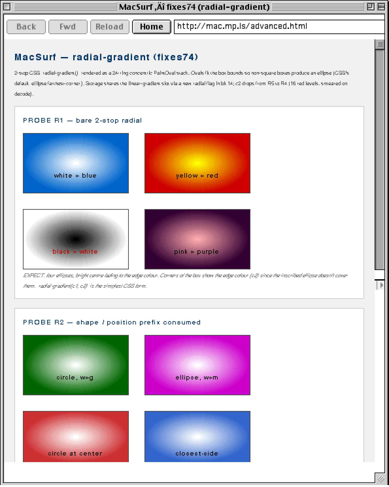
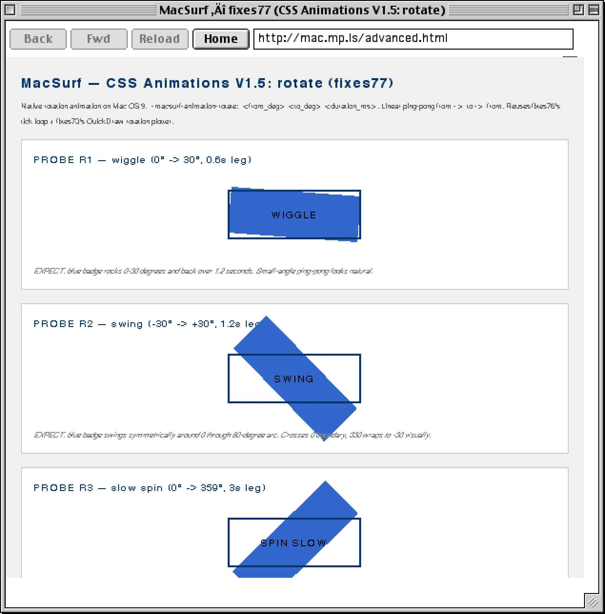
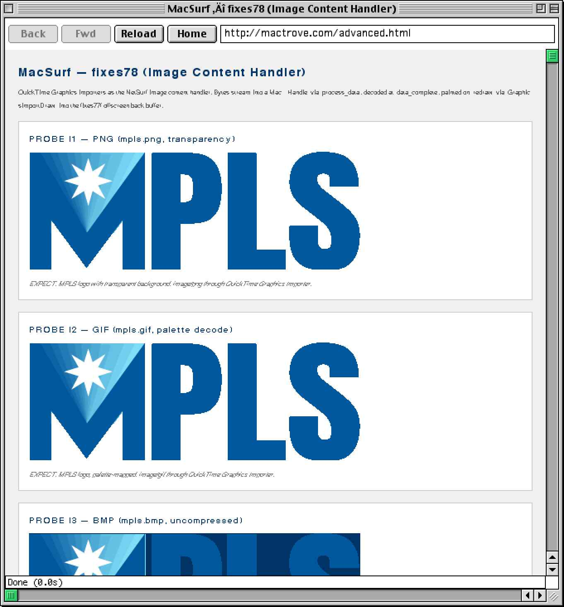
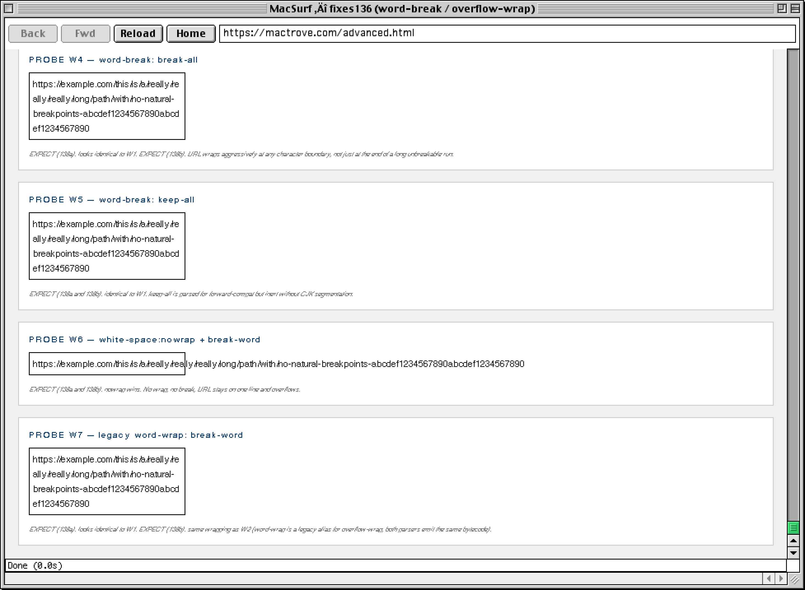
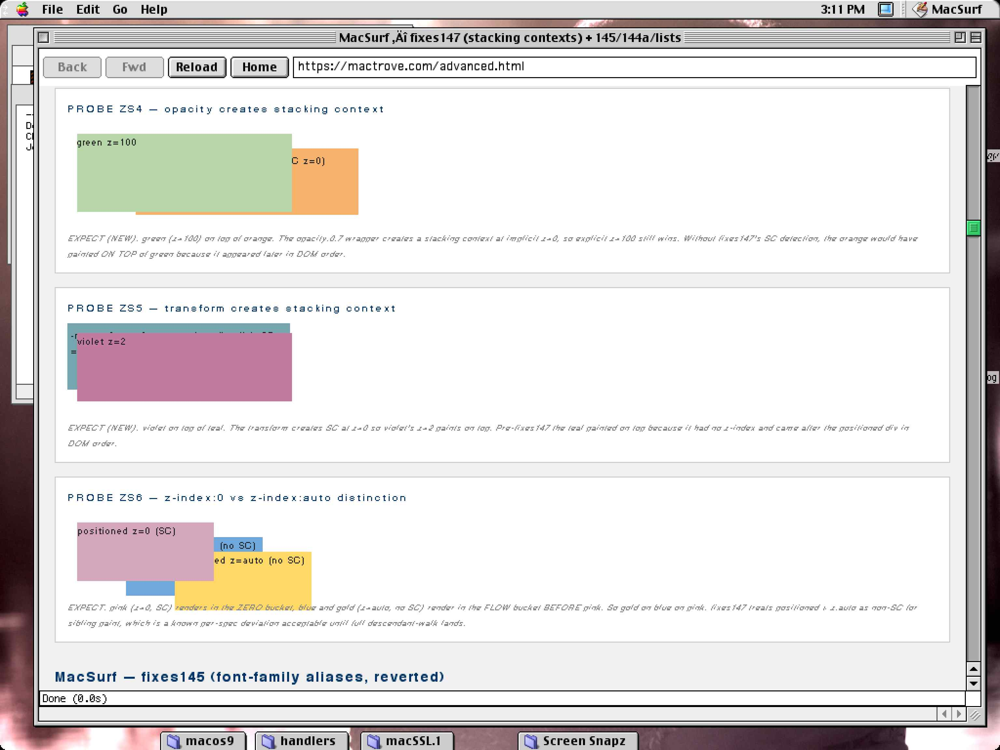
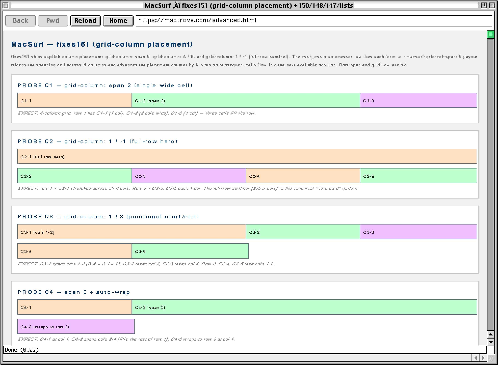

<p align="center">
  
</p>

<p>
  <strong>The modern web, on a 25-year-old Mac.</strong>
</p>

<p>
  MacSurf is a web browser for Classic Mac OS 9 PowerPC. CSS3, ES5 JavaScript, PNGs with alpha, running on a G3 iMac.
</p>

<div align="center">
  <a href="https://www.buymeacoffee.com/Ptricky">
    
  </a>
</div>
<p align="center">
  <a href="https://github.com/mplsllc/macsurf/releases"></a>
  <a href="./LICENSE"></a>
  <a href="https://github.com/mplsllc/macsurf/issues"></a>
  <a href="https://github.com/mplsllc/macsurf/stargazers"></a>
  <a href="https://en.wikipedia.org/wiki/Mac_OS_9"></a>
  <a href="https://en.wikipedia.org/wiki/PowerPC_G3"></a>
  <a href="https://en.wikipedia.org/wiki/CodeWarrior"></a>
  <a href="https://en.wikipedia.org/wiki/Carbon_(API)"></a>
  <a href="docs/css-status.md"></a>
  
  <a href="https://github.com/mplsllc/macsurf/discussions"></a>
</p>

---

<p align="center">
  
</p>

---

> [!WARNING]
> **MacSurf is early alpha.** It runs, it renders, it talks TLS 1.2 natively to real HTTPS sites (as of May 2026), and it executes JavaScript on a 233 MHz G3. That doesn't mean it's ready for daily driving — most of the modern web still won't work in it. Heavy SPAs, modern CSS features we haven't shipped, missing form interactions, slow JS on real hardware. Plenty is rough.
>
> But it's ready for people to try. If you've got a Power Mac G3 or G4 sitting around, please load it and see what breaks. Bug reports and screenshots from real hardware are exactly what this project needs. Contributors welcome too — there's a lot of CSS, DOM, and JS surface left to fill in, and the code is plain C89 (the same C you'd have written in 1999). See [docs/status.md](docs/status.md) for the current punch list.
>
> What you can expect: hand-built pages, retro-style sites, a respectable chunk of CSS Grid, native HTTPS with the full Mozilla CA bundle, and the strange thrill of running ES5 JavaScript on a PowerPC. What you shouldn't expect yet: smooth browsing on arbitrary modern sites, video, audio, WebGL, service workers, anything heavy on React.
>
> First numbered release was **0.1a1** in May 2026. Latest is **[v1.3 — Forward](https://github.com/mplsllc/macsurf/releases/latest)** (2026-05-29): **the first native TLS 1.3 implementation on Classic Mac OS, ever.** macTLS's TLS 1.3 layer is hand-written per RFC 8446 on BearSSL primitives, ships ChaCha20-Poly1305 + AES-128-GCM with x25519 key exchange and SHA-256 transcript, and is verified end-to-end on a G3 iMac by Cloudflare's `/cdn-cgi/trace` (reports `tls=TLSv1.3, kex=X25519`), Akamai's TLS 1.3 endpoint, BrowserLeaks (full TLS fingerprint), and How's My SSL (forward secrecy, no insecure ciphers, no TLS compression). Less than 24 hours after **[v1.2 — Sealed](https://github.com/mplsllc/macsurf/releases/tag/v1.2)** which closed the documented insecure-stub entropy hole with **macEntropy v1.0**, wired POST forms through both fetchers, and shipped a real download manager. Full v1.3 notes in [docs/release-notes/MacSurf-1.3.md](docs/release-notes/MacSurf-1.3.md). Predecessors: [v1.2 notes](docs/release-notes/MacSurf-1.2.md), [v1.0 notes](docs/release-notes/MacSurf-1.0.md).

---

## Why this exists

The web outgrew Classic Mac OS twenty years ago. Modern HTTPS finished it off around 2016. Pull a G3 or G4 out of the closet today and it can barely reach a single live website.

MacSurf is an attempt to fix that on the machine itself — no screenshot proxy, no remote terminal trick. A native browser, built with the tools that were already on the platform: CodeWarrior, Carbon, QuickDraw, Open Transport. Real CSS3 layouts and real JavaScript, running inside the 64 MB memory floor of a 1999 iMac. Since late May 2026 it speaks TLS 1.2 directly to the modern web through [macTLS](https://github.com/mplsllc/macTLS), a BearSSL-based stack that ships inside the browser binary with 121 trust anchors from the Mozilla CA bundle. No proxy needed anymore.

As far as we can tell, this is the first serious [NetSurf](https://www.netsurf-browser.org/) port to Classic Mac OS, and the first browser ever shipped on Mac OS 9 with native CSS Grid, CSS custom properties, and ES5 JavaScript.

---

## The progression

Each shot below is a real milestone, captured on a Power Macintosh G3 running Mac OS 9. The fix-number annotations match this repo's commit history.

<table>
<tr>
<td width="50%" align="center" valign="top">
  <br>
  <strong>v0.2: JavaScript on Mac OS 9</strong><br>
  <em>First real-world JS-bearing page. Duktape 2.7.0 ES5 evaluating live: <code>Math.sqrt</code>, JSON, ES5 array methods.</em>
</td>
<td width="50%" align="center" valign="top">
  <br>
  <strong>fixes73: CSS transforms</strong><br>
  <em>Native <code>transform: rotate() / scale() / translate()</code>. Integer Q15 sin/cos table, no FPU dependency, arbitrary angles on QuickDraw.</em>
</td>
</tr>
<tr>
<td width="50%" align="center" valign="top">
  <br>
  <strong>fixes74d: radial gradients</strong><br>
  <em>2-stop radial gradients via concentric <code>PaintOval</code> stack. 16 levels smeared on decode. Shape + position keywords parsed.</em>
</td>
<td width="50%" align="center" valign="top">
  <br>
  <strong>fixes77: CSS animations</strong><br>
  <em>Linear ping-pong animation player on top of fixes73 rotation. Wiggle, swing, and full 0&deg;&rarr;359&deg; spin.</em>
</td>
</tr>
<tr>
<td width="50%" align="center" valign="top">
  <br>
  <strong>fixes79b: PNG transparency</strong><br>
  <em>QuickTime Graphics Importer feeding the NetSurf image content handler. PNG + GIF + BMP, all with real transparency.</em>
</td>
<td width="50%" align="center" valign="top">
  <br>
  <strong>fixes136: word-break / overflow-wrap</strong><br>
  <em><code>word-break: break-all</code>, <code>keep-all</code>, <code>white-space: nowrap</code>, legacy <code>word-wrap: break-word</code>. URL-style aggressive wrapping.</em>
</td>
</tr>
<tr>
<td width="50%" align="center" valign="top">
  <br>
  <strong>fixes147: stacking contexts</strong><br>
  <em>CSS 2.1 painting order. Opacity, transforms, and explicit <code>z-index</code> all create new stacking contexts, properly painted on real hardware.</em>
</td>
<td width="50%" align="center" valign="top">
  <br>
  <strong>fixes151: CSS Grid column placement</strong><br>
  <em><code>grid-column: span N</code>, <code>1 / -1</code> full-row hero, positional <code>start / end</code>, span + auto-wrap. Real Grid layout on OS 9.</em>
</td>
</tr>
<tr>
<td width="100%" colspan="2" align="center" valign="top">
  <br>
  <strong>v1.0: Showcase</strong><br>
  <em>The new tool-belt toolbar, razor-sharp URL field, and matted icons rendering <a href="https://home.macsurf.org/">home.macsurf.org</a> on a G3 iMac running OS 9.2.2. Native HTTPS via macTLS direct to the origin, server-rendered portal, true-colour images end to end.</em>
</td>
</tr>
</table>

---

## The pieces

<table>
<tr><th align="left">Component</th><th align="left">Language</th><th align="left">Purpose</th></tr>
<tr>
<td><a href="browser/"><code>browser/</code></a></td>
<td>C (C89, CW8)</td>
<td>NetSurf fork with a <code>macos9</code> frontend. Carbon for the UI, QuickDraw for drawing, Open Transport for networking, Duktape for JS.</td>
</tr>
<tr>
<td><a href="proxy/"><code>proxy/</code></a></td>
<td>Go (stdlib only)</td>
<td>The old TLS-stripping HTTP proxy. Largely retired now that macTLS works natively, but still useful as a fallback or on machines without CarbonLib. Mac sends plain HTTP, proxy fetches via HTTPS, returns plain HTTP.</td>
</tr>
<tr>
<td><code>macTLS</code><br><sub>sibling repo</sub></td>
<td>C (CW8)</td>
<td>Native TLS 1.2 library for OS 9 — modern HTTPS straight from the Mac, no proxy required. BearSSL underneath, 121 trust anchors baked in.</td>
</tr>
</table>

---

## What works today

<table>
<tr>
<td valign="top" width="50%">

**Rendering pipeline**
- Full NetSurf fetch → parse → cascade → layout → plot
- Native libcss with `var()` resolution
- QuickDraw plotters with an offscreen GWorld back-buffer

**CSS** — around 150 properties consumed in layout
- Custom properties and `var()`
- Flex: `justify-content`, `align-content`, `order`
- Grid V1 plus `grid-template-columns/rows`, `gap`
- `border-radius`, `box-shadow`, opacity
- Linear and radial gradients
- `text-shadow`, `text-overflow: ellipsis`
- `transform` (rotate, translate, scale)
- z-index stacking contexts (CSS 2.1 painting order)
- CSS counters, viewport units, `aspect-ratio`
- Font-family aliases for sans, serif, monospace

[Full CSS status &rarr;](docs/css-status.md)

</td>
<td valign="top" width="50%">

**JavaScript** — Duktape 2.7.0, full ES5
- Closures, prototypes, regex, JSON
- Promises (polyfill), recursion, Mandelbrot
- About 6 seconds for `ackermann(3,7)` on a 233 MHz G3

**Images** — all five formats
- PNG with real per-pixel alpha (lodepng + `CopyMask`)
- GIF with palette transparency
- JPEG, BMP, TIFF

**Networking**
- Open Transport TCP, plain non-`InContext` calls
- HTTP/1.1 + chunked + keep-alive + 3xx follow
- Connection pooling, 15-second no-progress timeout
- HTTPS via macTLS (default) or the Go proxy (fallback)

**Browser chrome**
- Address bar, back / forward / reload / home
- Status bar, page-info, multi-window
- Smooth scroll bar, keyboard scrolling

</td>
</tr>
</table>

---

## Download

Latest is **[MacSurf v1.3 — Forward](https://github.com/mplsllc/macsurf/releases/tag/v1.3)** (2026-05-29): **first native TLS 1.3 on Classic Mac OS, ever.** Hand-written 1.3 layer per RFC 8446 on top of BearSSL primitives, ChaCha20-Poly1305 + AES-128-GCM with x25519, verified end-to-end by Cloudflare, Akamai, BrowserLeaks, and How's My SSL on a G3 iMac running OS 9.2.2. Predecessor [v1.2 "Sealed"](https://github.com/mplsllc/macsurf/releases/tag/v1.2) closed the entropy hole and wired POST forms + the download manager; [v1.0 "Showcase"](https://github.com/mplsllc/macsurf/releases/tag/v1.0) was the chrome-redesign release; [v0.6.2 "Speed-Run"](https://github.com/mplsllc/macsurf/releases/tag/v0.6.2) was the cold-load speedup (mactrove.com 30+s → ~2-3s); first numbered alpha at [v0.1a1](https://github.com/mplsllc/macsurf/releases/tag/v0.1a1).

- **[MacSurf.sit](https://github.com/mplsllc/macsurf/releases/download/v1.3/MacSurf.sit)** — the v1.3 binary, ready to run. Expand on Mac OS 9.1+ with CarbonLib 1.5+ and launch.
- Building from source: clone the repo, then on the Mac side open `browser/netsurf/frontends/macos9/MacSurf.mcp` in CodeWarrior 8 and choose Build. v1.3 builders pulling onto a v1.2 workspace need to add four macTLS files to enable TLS 1.3: `bearssl/src/ec/ec_c25519_m15.c`, `os9/ostls_tls13_keysched.c`, `os9/ostls_tls13_record.c`, `os9/ostls_tls13_handshake.c`. v1.2 builders on a 1.0 workspace need to add `desktop/download.c` to the project file list. The earliest release also ships a [BuildPack.sit](https://github.com/mplsllc/macsurf/releases/download/v0.1a1/MacSurf-BuildPack.sit) snapshot with the CW8 project pre-wired, but current builds work straight from a fresh clone.

Earlier alpha notes if you want context: [docs/release-notes/MacSurf-0.1a1.md](docs/release-notes/MacSurf-0.1a1.md).

---

## Getting started

<table>
<tr>
<td valign="top" width="50%">

### Building the browser
MacSurf is built on Mac OS 9 with CodeWarrior 8 Pro (8.3 update). The source is cross-compile-clean against Retro68 PowerPC GCC, which is what we use for fast Linux-side syntax checks.

- [Mac-side build guide](docs/codewarrior-setup.md)
- [Linux cross-dev workflow](docs/cross-dev-from-linux.md)

</td>
<td valign="top" width="50%">

### Running the proxy
A single Go binary. No config files. No dependencies beyond stdlib.

```bash
cd proxy
go build -o macsurf-proxy
./macsurf-proxy
