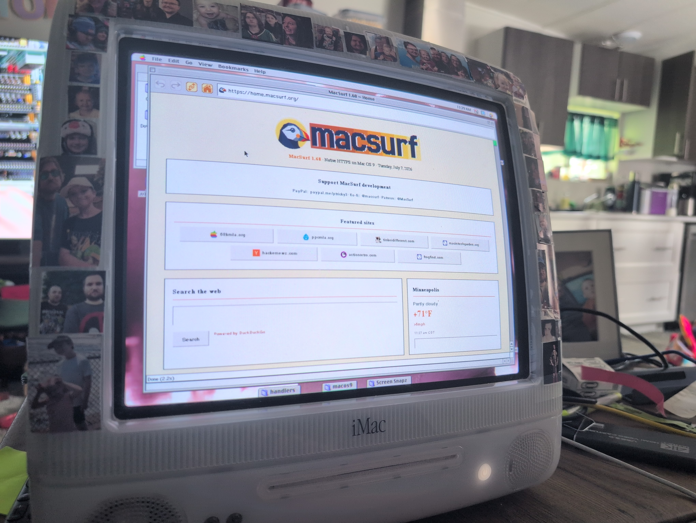
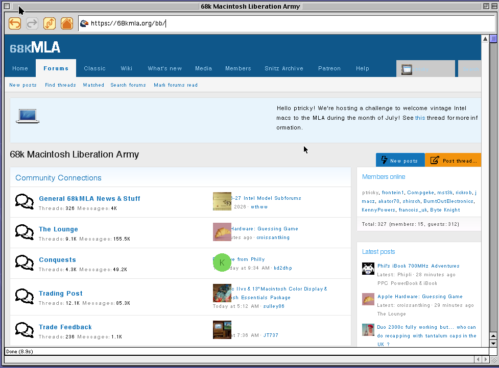
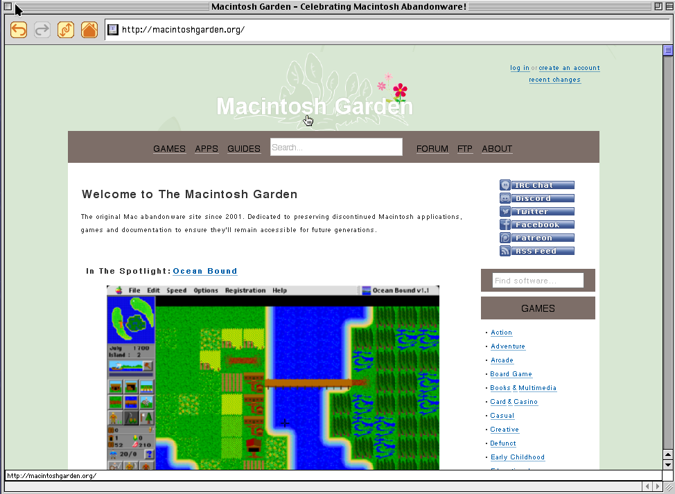
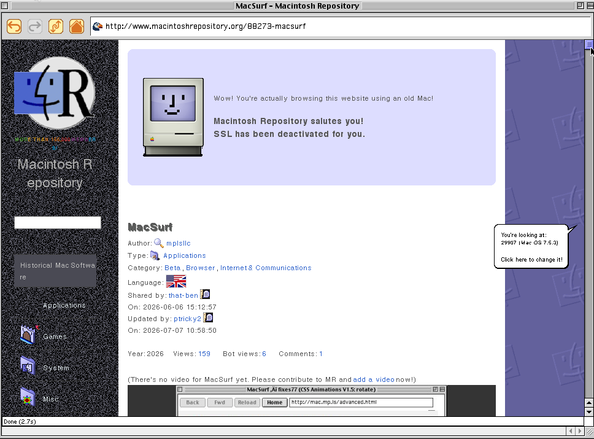
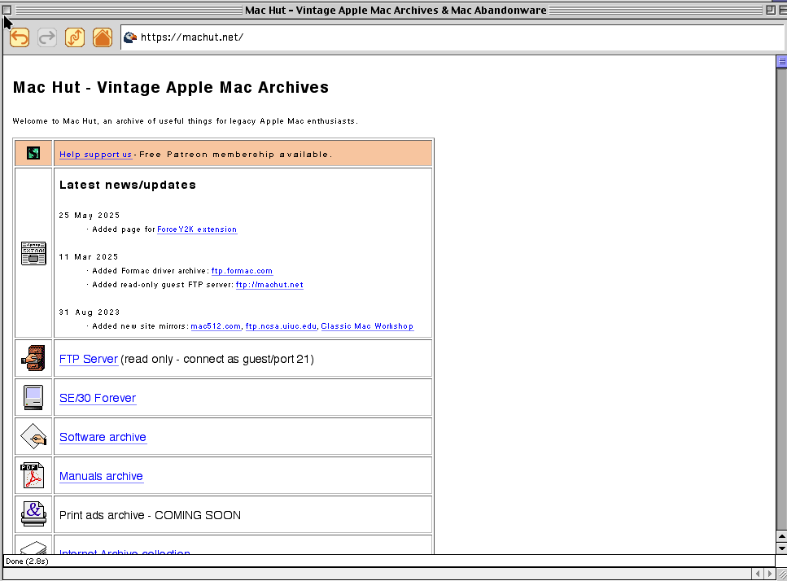
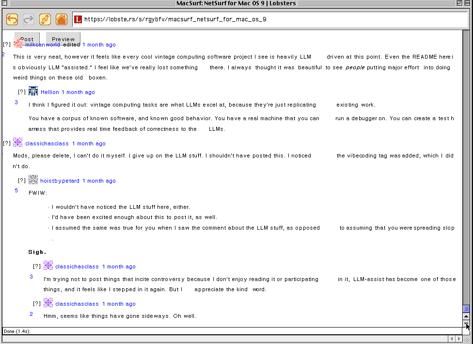
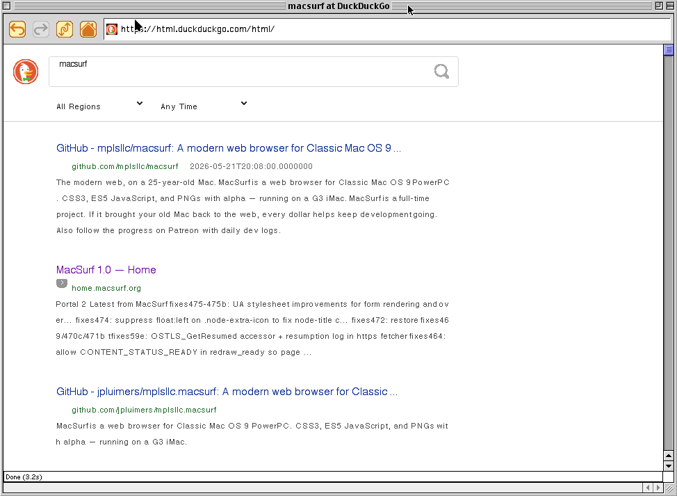
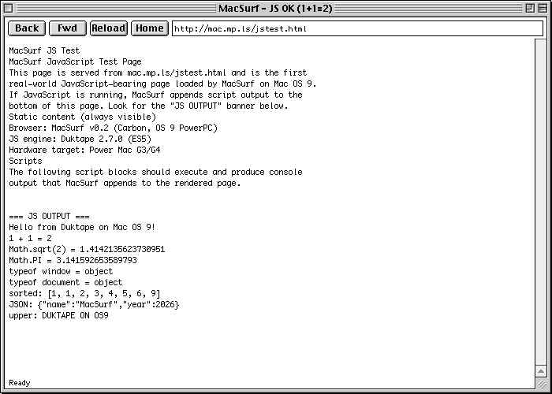
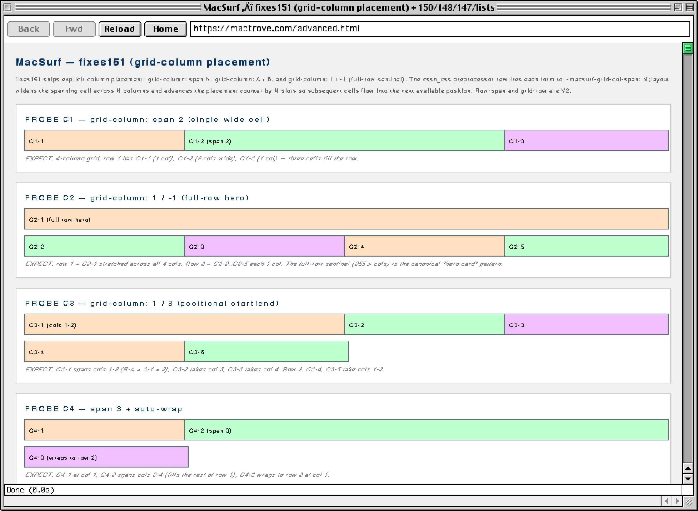

  

<strong>The modern web, on a 25-year-old Mac.</strong>

  A native web browser for Classic Mac OS 9 on PowerPC — real CSS3, modern JavaScript, and HTTPS, running on a G3 iMac. No proxy, no second machine.

  
   
  <em>MacSurf 1.68.1 on a Power Mac G3 iMac, rendering <a href="https://home.macsurf.org/">home.macsurf.org</a> over native HTTPS.</em>

---

  <em>MacSurf is a full-time project. If it brought your old Mac back to the web, a few dollars keeps development going — and you'll get the dev logs.</em>

  
  &nbsp;&nbsp;
  

<strong>Thanks to our supporters:</strong> Shlooom (Patreon) &middot; kilgeist (Ko-Fi)

---

> [!NOTE]
> **1.68.1 "macQJS"** runs a real modern JavaScript engine, speaks TLS 1.3 natively, keeps you logged in, and renders full desktop forums on a 233 MHz G3. It's at its best on hand-built pages, retro sites, and forums. Very heavy modern apps — GitHub, video, React-heavy SPAs — still don't render. This is honest, in-progress software. Got a G3 or G4? Load it up and tell us what breaks. See [docs/status.md](docs/status.md) for the current punch list.

## Why this exists

The web outgrew Classic Mac OS twenty years ago, and modern HTTPS finished the job around 2016. Pull a G3 or G4 out of the closet today and it can barely reach a single live site.

MacSurf fixes that on the machine itself — no screenshot proxy, no remote-terminal trick. It's a native browser built with the tools that shipped on the platform: CodeWarrior, Carbon, QuickDraw, Open Transport. It speaks TLS 1.3 straight to the modern web through [macTLS](https://github.com/mplsllc/macTLS), a BearSSL-based stack baked into the binary with the full Mozilla CA bundle, and runs modern JavaScript through [macQJS](https://github.com/mplsllc/macQJS), a QuickJS port for Mac OS 9.

As far as we can tell, it's the first serious [NetSurf](https://www.netsurf-browser.org/) port to Classic Mac OS, and the first Mac OS 9 browser with native CSS Grid, CSS custom properties, and an on-device modern JavaScript engine.

## Real sites, on real hardware

Every shot below is a live site, captured on a Power Mac G3 running Mac OS 9.2.2.

<table>
<tr>
<td width="50%" align="center" valign="top"> <strong>68kmla.org</strong> <em>A full XenForo forum — logged in, full-width, posting replies.</em></td>
<td width="50%" align="center" valign="top"> <strong>macintoshgarden.org</strong> <em>The classic Mac abandonware library.</em></td>
</tr>
<tr>
<td width="50%" align="center" valign="top"> <strong>macintoshrepository.org</strong> <em>Thumbnails, tables, and all.</em></td>
<td width="50%" align="center" valign="top"> <strong>machut.net</strong> <em>Vintage Mac archives, over native HTTPS.</em></td>
</tr>
<tr>
<td width="50%" align="center" valign="top"> <strong>lobste.rs</strong> <em>Reading its own thread — nested comments and all.</em></td>
<td width="50%" align="center" valign="top"> <strong>DuckDuckGo</strong> <em>Search that works.</em></td>
</tr>
</table>

<strong>How it got here</strong> — a couple of early milestones

 

<table>
<tr>
<td width="50%" align="center" valign="top"> <strong>v0.2 — JavaScript on Mac OS 9</strong> <em>The first JS-bearing page evaluating live, on-device.</em></td>
<td width="50%" align="center" valign="top"> <strong>CSS Grid</strong> <em>Real Grid layout — spans, full-row heroes, auto-wrap.</em></td>
</tr>
</table>

## The pieces

<table>
<tr><th align="left">Component</th><th align="left">Language</th><th align="left">Purpose</th></tr>
<tr>
<td><a href="browser/"><code>browser/</code></a></td>
<td>C (C89, CW8)</td>
<td>NetSurf fork with a <code>macos9</code> frontend. Carbon for the UI, QuickDraw for drawing, Open Transport for networking, macQJS for JavaScript.</td>
</tr>
<tr>
<td><code>macTLS</code> <a href="https://github.com/mplsllc/macTLS">sibling repo</a></td>
<td>C (CW8)</td>
<td>Native TLS 1.3 (1.2 fallback) for OS 9 — HTTPS straight from the Mac. BearSSL underneath, full Mozilla CA bundle baked in.</td>
</tr>
<tr>
<td><code>macQJS</code> <a href="https://github.com/mplsllc/macQJS">sibling repo</a></td>
<td>C (CW8)</td>
<td>A QuickJS port for Classic Mac OS — modern ES2023 JavaScript on PowerPC.</td>
</tr>
</table>

## What works today

<table>
<tr>
<td valign="top" width="50%">

**Rendering**
- Full NetSurf fetch → parse → cascade → layout → plot
- Native libcss with `var()`, ~150 properties consumed in layout
- Flexbox, CSS Grid, gradients, `border-radius`, `box-shadow`, opacity, transforms, z-index stacking
- PNG (real alpha), GIF, JPEG, BMP, TIFF
- Downloadable web-font icon glyphs

[Full status →](docs/status.md)

</td>
<td valign="top" width="50%">

**JavaScript — macQJS (QuickJS, ES2023)**
- `let`/`const`, arrows, classes, template literals, Promises, generators, modern regex
- Runs real site bundles on-device

**Networking**
- HTTP/1.1: chunked, keep-alive, 3xx follow, connection pooling
- HTTPS via macTLS — TLS 1.3, 1.2 fallback, full CA bundle
- Cookies and logins that persist

**Chrome**
- Address bar, back / forward / reload / home, bookmarks menu, downloads manager
- Text input: caret, selection, cut / copy / paste, Tab between fields
- Multi-window, smooth scroll bar, keyboard scrolling

</td>
</tr>
</table>

## Download

**[MacSurf 1.68.1 "macQJS"](https://github.com/mplsllc/macsurf/releases/latest)** (2026-07-08) — the JavaScript engine was replaced (Duktape ES5 → macQJS / QuickJS ES2023), plus working text input, persistent logins, a bookmarks menu and downloads manager, the split-scrollbar render fix, downloadable web-font icons, and a big performance pass (near-instant startup, image / font disk cache). Named for **[68kmla.org](https://68kmla.org)**, the community that drove the cycle. [Full release notes →](docs/release-notes/MacSurf-1.68.1.md)

- **[Download the .sit →](https://github.com/mplsllc/macsurf/releases/latest)** — expand with StuffIt Expander on Mac OS 9.1+ (CarbonLib 1.5+) and double-click. No installer.
- Already on a Mac OS 9 machine? Grab it from the plain-HTTP **[macsurf.org](http://macsurf.org/)** — GitHub doesn't render on-device yet.
- [All releases →](https://github.com/mplsllc/macsurf/releases)

## Building

MacSurf builds on Mac OS 9 with CodeWarrior 8 Pro (8.3 update). The source is cross-compile-clean against Retro68 PowerPC GCC, which we use for fast Linux-side syntax checks.

- [Mac-side build guide](docs/codewarrior-setup.md)
- [Linux cross-dev workflow](docs/cross-dev-from-linux.md)

---

  Native HTTPS via <a href="https://github.com/mplsllc/macTLS">macTLS</a> &middot;
  JavaScript via <a href="https://github.com/mplsllc/macQJS">macQJS</a> &middot;
  built on <a href="https://www.netsurf-browser.org/">NetSurf</a> &middot;
  <a href="https://www.youtube.com/watch?v=PLpbHSXca60">intro video</a>

 

<em><a href="https://www.patreon.com/MacSurf/posts/this-is-for-gary-163164919">For Gary &amp; Kaija</a></em>

