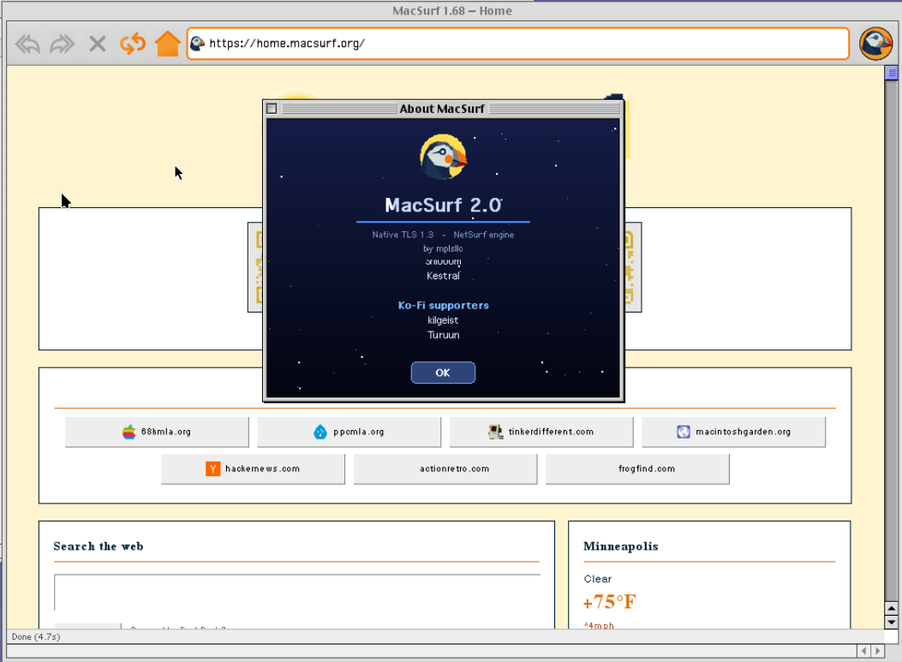
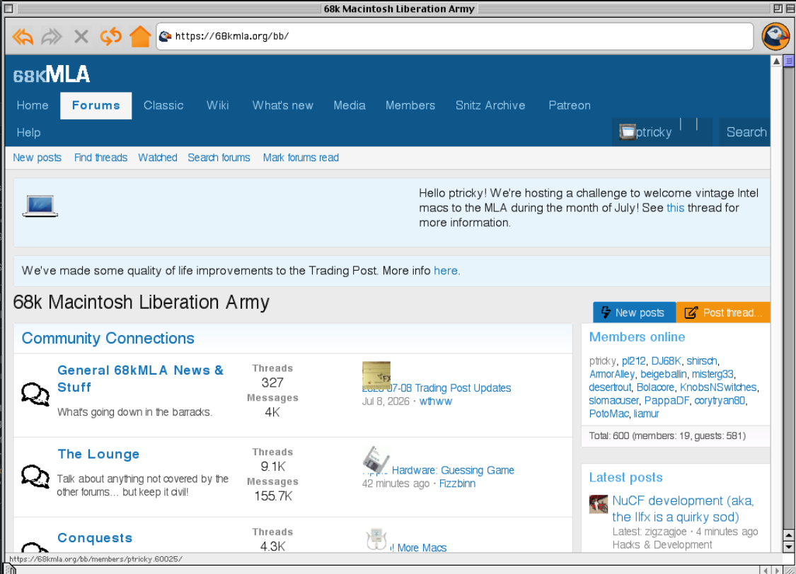
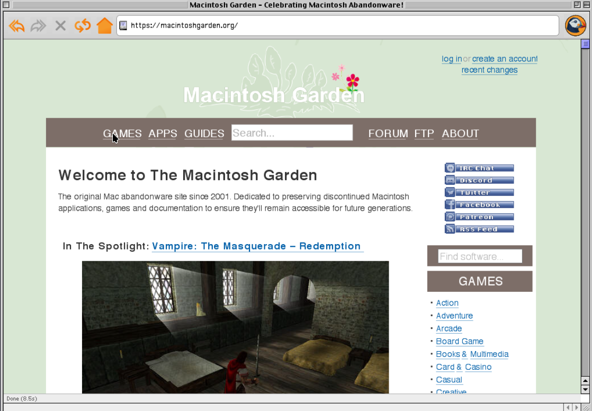
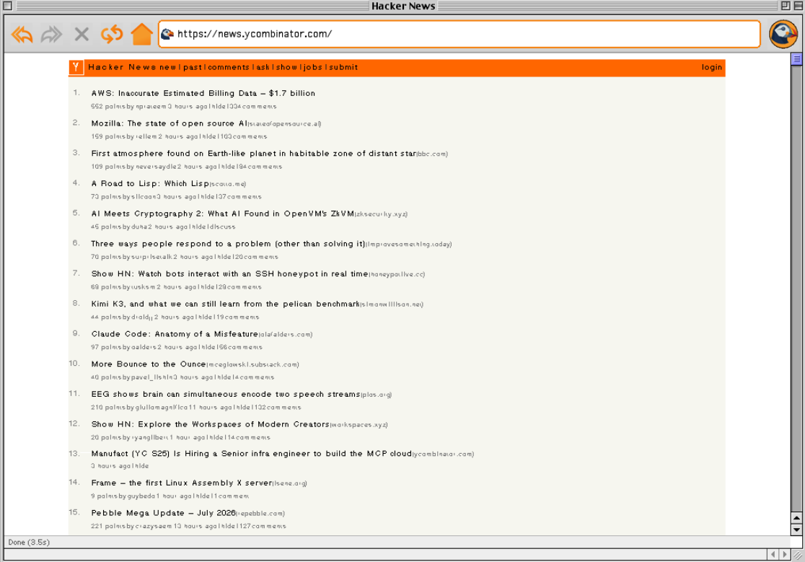
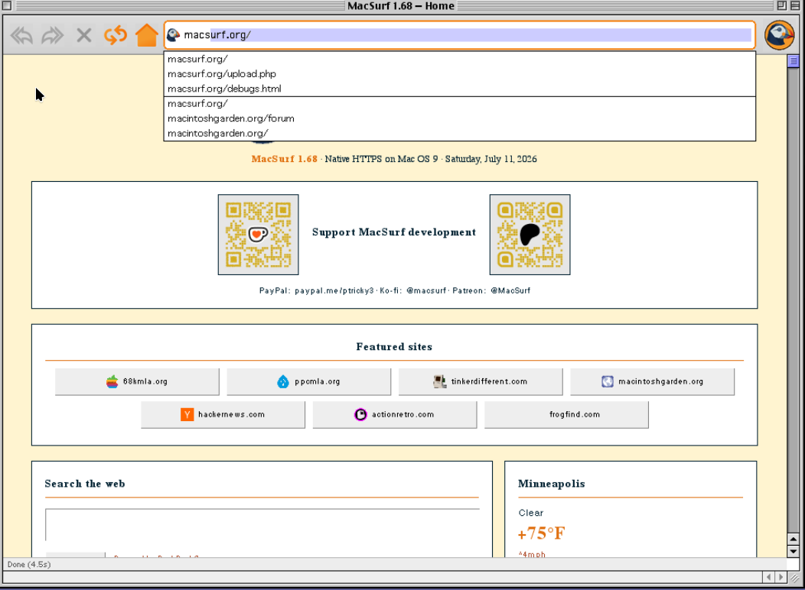

  

<strong>The modern web, on a 25-year-old Mac.</strong>

  A native browser for the Carbon era, Mac OS 8.6 through Mac OS X 10.6: real CSS, modern JavaScript, and HTTPS on the Mac itself. No proxy, no second machine.

  
   
  <em>MacSurf 2.0.5 on a Power Mac G3 iMac, rendering <a href="https://hackaday.com/">hackaday.com</a> at full desktop width over native HTTPS.</em>

---

<table>
<tr>
<td width="50%" valign="top" align="center">

### 🆓 Free monthly stable

A tested build on [**macsurf.org**](https://macsurf.org), free for everyone, with real hardware testing behind it.

**Latest stable: MacSurf 2.3 "OPEN TABS"**

</td>
<td width="50%" valign="top" align="center">

### ⭐ Weekly, for supporters

In-progress builds land in **Beta-Box** every week, ahead of every stable release, with dev notes along the way.

[**Become a supporter →**](https://github.com/sponsors/mplsllc)

</td>
</tr>
</table>

Every project stays free as source. Build it yourself and you never need Beta-Box. You are paying for the build and the cadence, not for access.

<strong>Support development</strong>

  
  &nbsp;
  
  &nbsp;
  

<strong>Follow along</strong>

  
  &nbsp;
  

<strong>Thanks to our supporters:</strong> Shlooom, Kestral, Mothra (Patreon) &middot; kilgeist, Turuun, Rogue (Ko-Fi)

  

---

> [!NOTE]
> **2.3 "OPEN TABS"** is the largest MacSurf release since 2.0. Tabs are finally enabled, with independent page, scroll, history, rendering and JavaScript state inside one native Mac window. Underneath that is a major dynamic-page/lifecycle rewrite, a much larger browser API surface, more CSS and image/SVG support, rebuilt native managers, stronger networking and security, and a long hardware-driven stability campaign. MacSurf remains honest, in-progress software; some very heavy modern applications still expose layout and API gaps. See [the 2.3 release notes](docs/release-notes/MacSurf-2.3.md) and [docs/status.md](docs/status.md) for details.

## Why this exists

The web outgrew Classic Mac OS twenty years ago, and modern HTTPS finished the job around 2016. Pull a G3 or G4 out of the closet today and it can barely reach a single live site.

MacSurf fixes that on the machine itself, with no screenshot proxy and no remote-terminal trick. It is a native browser built with the tools that shipped on the platform: CodeWarrior, Carbon, QuickDraw, Open Transport. It speaks TLS 1.3 straight to the modern web through [macTLS](https://github.com/mplsllc/macTLS), a BearSSL-based stack baked into the binary with the full Mozilla CA bundle, and runs modern JavaScript through [macQJS](https://github.com/mplsllc/macQJS), a QuickJS port for Mac OS 9.

As far as we can tell, it is the first serious [NetSurf](https://www.netsurf-browser.org/) port to Classic Mac OS, and the first Mac OS 9 browser with native CSS Grid, CSS custom properties, and an on-device modern JavaScript engine.

## Real sites, on real hardware

Every shot below is a live site, captured on a Power Mac G3 running Mac OS 9.2.2 with MacSurf 2.0.5. They are kept here as a hardware baseline; MacSurf 2.3 has moved substantially beyond the browser shown in these images.

<table>
<tr>
<td width="50%" align="center" valign="top"> <strong>hackaday.com</strong> <em>A modern, JavaScript-heavy news site at full desktop width.</em></td>
<td width="50%" align="center" valign="top"> <strong>68kmla.org</strong> <em>A full XenForo forum: logged in, full-width, correct text size.</em></td>
</tr>
<tr>
<td width="50%" align="center" valign="top"> <strong>macintoshgarden.org</strong> <em>Image-heavy and fully styled, over native HTTPS.</em></td>
<td width="50%" align="center" valign="top"> <strong>news.ycombinator.com</strong> <em>Hacker News: login and front page, no phantom boxes.</em></td>
</tr>
</table>

## New in 2.3

**Tabs.** One native Mac window can now host multiple independent browser pages. Command-T opens a tab; Command-W closes the current tab. Background tabs retain their own JavaScript realm, title, URL, content and scroll state without taking over the foreground chrome.

The release also brings a major dynamic-page and JavaScript compatibility pass; deeper DOM reconstruction safety; CSS math, sizing, Grid, variables and paint improvements; native WebP and stronger SVG; a rebuilt Downloads window; improved Preferences, Bookmarks and History; tighter HTTPS/security behavior; and a large body of crash- and lifetime fixes.

MacSurf 2.3 supports **Mac OS 8.6 through Mac OS X 10.6**. On Intel Macs, the PowerPC build runs under **Rosetta** where available.

[Full 2.3 notes &rarr;](docs/release-notes/MacSurf-2.3.md)

## New in 2.0.5

The headline is **hackaday.com** rendering at full desktop width (shown above): correct type, article cards, and images in place.

Under it: text is measured in real device pixels (author `font-size` no longer draws 25% too small), a large modern-CSS pass (justified text, soft hyphens, logical properties, box-alignment shorthands, grid auto-sizing), a more capable JavaScript engine (real `fetch`/`XHR`, resolving Promise chains, DOM traversal, `document.cookie`), and tracker/ad-network blocking. [Full 2.0.5 notes &rarr;](docs/release-notes/MacSurf-2.0.5.md)

## New in 2.0

<table>
<tr>
<td colspan="2" align="center" valign="top"> <strong>Type-ahead address bar</strong> <em>History- and bookmark-backed suggestions as you type.</em></td>
</tr>
<tr>
<td width="50%" align="center" valign="top"> <strong>History manager</strong> <em>Day-grouped, searchable, clearable. A real window.</em></td>
<td width="50%" align="center" valign="top"> <strong>Bookmark manager</strong> <em>Save, organize, and jump straight from the menu.</em></td>
</tr>
</table>

<strong>Earlier shots</strong>: the same sites on previous builds

 

<table>
<tr>
<td width="50%" align="center" valign="top"> <strong>68kmla.org</strong></td>
<td width="50%" align="center" valign="top"> <strong>macintoshgarden.org</strong></td>
</tr>
<tr>
<td width="50%" align="center" valign="top"> <strong>macintoshrepository.org</strong></td>
<td width="50%" align="center" valign="top"> <strong>machut.net</strong></td>
</tr>
<tr>
<td width="50%" align="center" valign="top"> <strong>lobste.rs</strong></td>
<td width="50%" align="center" valign="top"> <strong>DuckDuckGo</strong></td>
</tr>
</table>

<strong>How it got here</strong>: a couple of early milestones

 

<table>
<tr>
<td width="50%" align="center" valign="top"> <strong>v0.2: JavaScript on Mac OS 9</strong> <em>The first JS-bearing page evaluating live, on-device.</em></td>
<td width="50%" align="center" valign="top"> <strong>CSS Grid</strong> <em>Real Grid layout: spans, full-row heroes, auto-wrap.</em></td>
</tr>
</table>

## The pieces

<table>
<tr><th align="left">Component</th><th align="left">Language</th><th align="left">Purpose</th></tr>
<tr>
<td><a href="browser/"><code>browser/</code></a></td>
<td>C (C89, CW8)</td>
<td>NetSurf fork with a <code>macos9</code> frontend. Carbon for the UI, QuickDraw for drawing, Open Transport for networking, macQJS for JavaScript.</td>
</tr>
<tr>
<td><code>macTLS</code> <a href="https://github.com/mplsllc/macTLS">sibling repo</a></td>
<td>C (CW8)</td>
<td>Native TLS 1.3 (1.2 fallback) for OS 9: HTTPS straight from the Mac. BearSSL underneath, full Mozilla CA bundle baked in.</td>
</tr>
<tr>
<td><code>macQJS</code> <a href="https://github.com/mplsllc/macQJS">sibling repo</a></td>
<td>C (CW8)</td>
<td>A QuickJS port for Classic Mac OS: modern ES2023 JavaScript on PowerPC.</td>
</tr>
</table>

## What works today

<table>
<tr>
<td valign="top" width="50%">

**Rendering & CSS**
- Full NetSurf fetch, parse, cascade, layout and QuickDraw paint pipeline
- CSS custom properties with selector/media scope, specificity, inheritance and deferred `var()` resolution
- Flexbox and CSS Grid, including stronger auto-track sizing, `minmax()`, `justify-self`, row/column gaps and stretch behavior
- CSS math and sizing: `calc()`, `min()`, `max()`, `clamp()`, min/max/fit-content and viewport-relative sizing
- Gradients, `border-radius`, `box-shadow`, opacity, transforms, z-index stacking and improved background clipping/origin
- PNG, GIF, JPEG, BMP, TIFF and **native WebP**, including animated WebP machinery
- Much stronger inline/external **SVG**: sizing, `viewBox`, aspect-ratio modes, shapes, transforms, fill/stroke and embedded raster images
- Downloadable web fonts, including WOFF2/Brotli fixes

[Full 2.3 release notes &rarr;](docs/release-notes/MacSurf-2.3.md)

</td>
<td valign="top" width="50%">

**JavaScript, macQJS (QuickJS / ES2023)**
- Modern language features plus **ES modules**
- `fetch` / XHR, Headers, Request, Response, AbortController / AbortSignal and native cancellation
- Promises, microtasks, timers, `requestAnimationFrame`, persistent `localStorage` and `sendBeacon`
- MutationObserver, ResizeObserver and IntersectionObserver
- Stronger DOM traversal/selectors, cloning/replacement, reflected properties, events and prototype relationships
- Canvas 2D compatibility surface with native-font `measureText()`
- `crypto.getRandomValues()` and `randomUUID()`

**Networking & security**
- HTTP/1.1: chunked transfer, keep-alive, redirects, pooling, cache revalidation and gzip responses
- HTTPS via macTLS: TLS 1.3 with TLS 1.2 fallback and Mozilla CA bundle
- Certificate rejection fails closed; scripted HTTPS requests cannot silently downgrade to HTTP
- Persistent cookies/logins, tighter referrer handling and tracker blocking

**Browser chrome**
- **Tabbed browsing** with independent page, history, scroll, rendering and JavaScript state
- Address bar, back / forward / reload / home and type-ahead suggestions
- Rebuilt Downloads window with progress, speed, ETA, cancel, open and Reveal in Finder
- Native Preferences, Bookmarks and History managers
- Text input, selection, clipboard commands, keyboard navigation and native form controls

</td>
</tr>
</table>

### Supported systems

MacSurf 2.3 supports **Mac OS 8.6 through Mac OS X 10.6 Snow Leopard**.

- PowerPC Macs run MacSurf directly.
- Intel Macs can run the PowerPC build through **Rosetta** where available.
- Mac OS 9 remains the primary target and the environment most heavily tested on original hardware.
- Recommended memory: **128 MB minimum**, **256 MB recommended**, **384 MB for the heaviest JavaScript sites**.

### Stability and diagnostics

A large part of 2.3 is work you should not have to notice: stronger page/runtime ownership, safer DOM reconstruction, guarded late callbacks, cache/content lifetime fixes, image reuse across reconvert, TLS bounds checks, and tab isolation.

MacSurf also now has a much deeper built-in diagnostic system for correlating navigation, documents, frames, network requests, JavaScript tasks, timers, mutations, XHR/fetch, Promise rejections, layout, paint and compatibility gaps. The final Tiger multi-tab stress campaign completed **20/20 cycles with zero crashes and zero hangs**, followed by testing on Mac OS 9.2.2 hardware.

## Download

**[MacSurf 2.3 "OPEN TABS"](https://github.com/mplsllc/macsurf/releases/latest)** (2026-09-19). See what changed in the [full 2.3 release notes &rarr;](docs/release-notes/MacSurf-2.3.md).

- **[Download MacSurf &rarr;](https://macsurf.org/download.html)**: expand with StuffIt Expander and double-click. MacSurf supports Mac OS 8.6 through Mac OS X 10.6; on Intel Macs the PowerPC build runs under Rosetta where available. No installer.
- Already on a Mac OS 9 machine? Grab it from the plain-HTTP **[macsurf.org](http://macsurf.org/)**, since GitHub does not render on-device yet.
- [All releases &rarr;](https://github.com/mplsllc/macsurf/releases)

Want the builds between releases? Weekly in-progress builds land in **Beta-Box** for [supporters](https://github.com/sponsors/mplsllc), ahead of every stable release.

## Building

MacSurf builds on Mac OS 9 with CodeWarrior 8 Pro (8.3 update). The source is cross-compile-clean against Retro68 PowerPC GCC, which we use for fast Linux-side syntax checks.

- [Mac-side build guide](docs/codewarrior-setup.md)
- [Linux cross-dev workflow](docs/cross-dev-from-linux.md)

---

  Native HTTPS via <a href="https://github.com/mplsllc/macTLS">macTLS</a> &middot;
  JavaScript via <a href="https://github.com/mplsllc/macQJS">macQJS</a> &middot;
  built on <a href="https://www.netsurf-browser.org/">NetSurf</a> &middot;
  <a href="https://www.youtube.com/watch?v=PLpbHSXca60">intro video</a>

 

  

<em><a href="https://www.patreon.com/MacSurf/posts/this-is-for-gary-163164919">For Gary &amp; Kaija</a></em>

