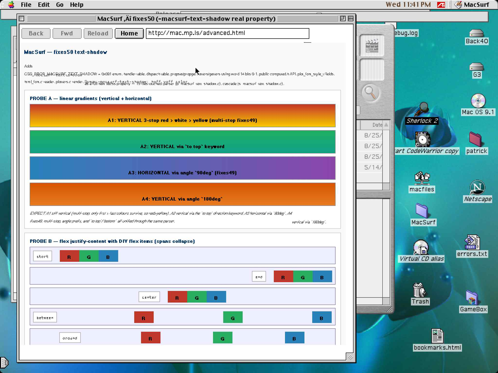
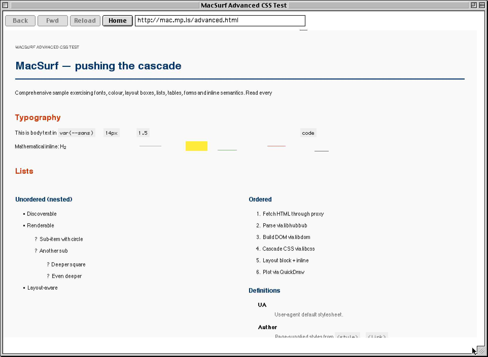
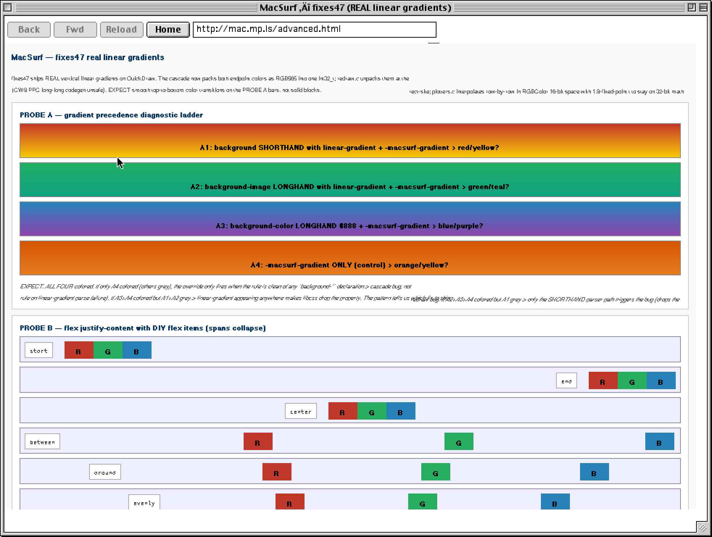
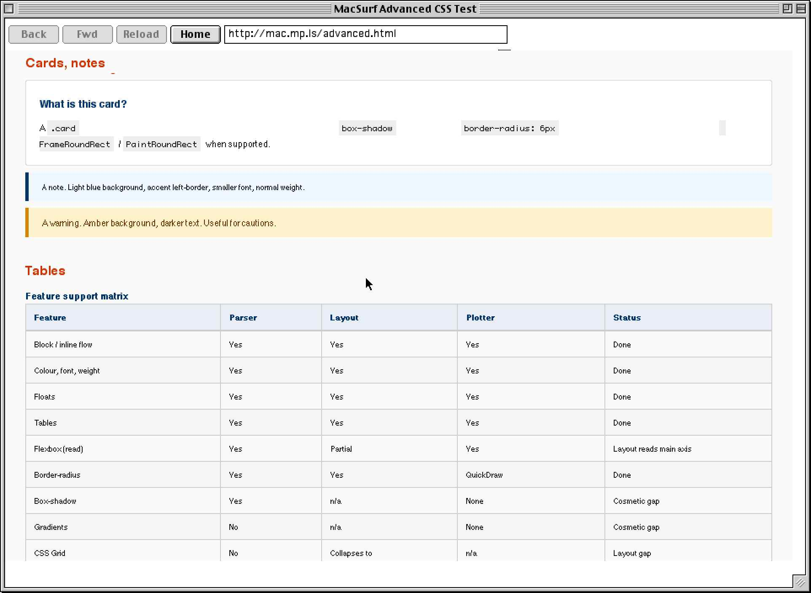
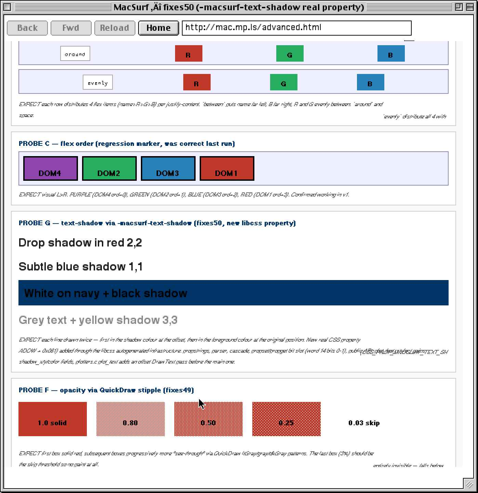
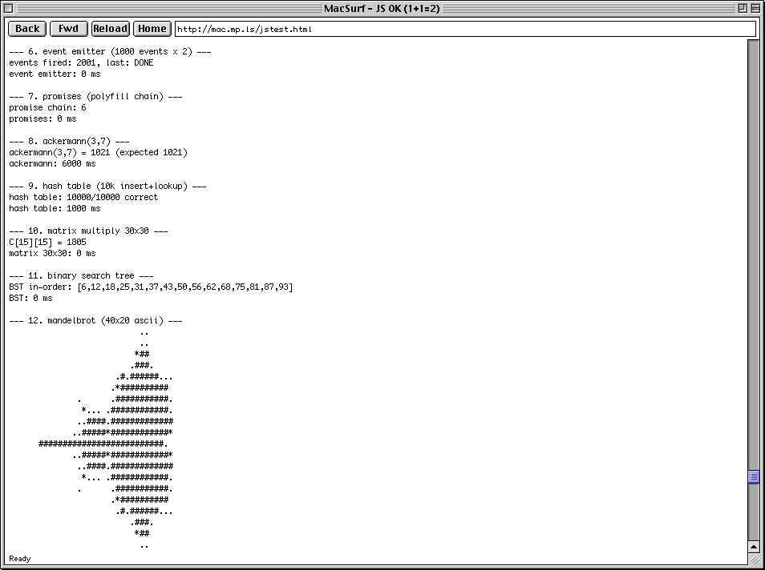

# MacSurf: The Story of JavaScript on Mac OS 9

## The First ES5 JavaScript Engine on Classic Macintosh

On April 15, 2026, a Power Macintosh running Mac OS 9 executed a JavaScript program and displayed the result in a web browser window. The title bar read "MacSurf - JS OK (1+1=2)." It was the first time a modern ECMAScript engine had ever run on Classic Mac OS hardware.

By the end of that same night, MacSurf was rendering ASCII Mandelbrot fractals computed entirely in JavaScript, sorting 5,000-element arrays via quicksort, evaluating the Ackermann function to depth 1,021, and parsing JSON — all inside a Carbon application on a machine from 1998.

No consumer browser has ever done this before. Classic IE 5.x shipped JScript 5, but it predates ES5 and ran on Mac OS X, not Classic. Classilla attempted Mozilla's SpiderMonkey on OS 9 but JavaScript was its primary source of crashes and instability. MacSurf is the first browser to ship a stable, fully functional ES5 engine on this platform.

---

## The Machine

**Power Macintosh G3 Minitower (Beige), Machine ID 510**
- Processor: PowerPC G4 at 400 MHz (Sonnet upgrade card — the beige G3 never shipped with a G4)
- RAM: 192 MB (32 MB + 32 MB + 128 MB DIMMs in slots J3/J4/J5)
- Video Memory: 6 MB
- External L2 Cache: Not installed
- Startup Drive: "Back40" (Internal ATA)
- OS: Mac OS 9.1 (US)
- CarbonLib: 1.6
- QuickTime: 6.0.3
- Virtual Memory: 193 MB (on Back40)
- Network: 10.42.0.204 via Ethernet built-in
- Compiler: Metrowerks CodeWarrior 8 Pro (8.3 update)

This is Gary Hansen's machine with an aftermarket Sonnet G4 processor upgrade installed — a pretty sweet find. The Sonnet Processor Upgrade 1.4.5 extension is active in the System Folder. Every line of code was compiled on it. Every screenshot was captured from it. Every benchmark was measured on it. There is no emulator in this story. System profile generated live from the machine on April 15, 2026 at 8:47 PM.

---

## The Technology Stack

MacSurf exists because of several remarkable pieces of technology, most of them older than the machine itself:

### NetSurf (netsurf-browser.org)
The browser engine. An open-source web browser written in C with no external dependencies, designed for low-resource systems. NetSurf's clean architecture — with explicit support for cooperative multitasking and non-POSIX platforms via its frontend abstraction — made the port to Mac OS 9 possible. The RISC OS and AmigaOS frontends served as direct references. MacSurf links against all five NetSurf core libraries: libparserutils, libhubbub, libdom, libcss, and libwapcaplet — approximately 125,000 lines of C across 443 source files.

### Duktape 2.7.0 (duktape.org)
The JavaScript engine. An embeddable ES5/ES5.1 interpreter written in portable C89 by Sami Vaarala. Duktape's single-file amalgamation (`duktape.c`, 3.6 MB) compiled under CodeWarrior 8's strict C89 mode with zero source patches to the engine itself — only configuration changes in `duk_config.h`. The engine provides full ES5.1 compliance including regular expressions, JSON, closures, prototypes, exception handling, and the complete set of built-in objects. Its ~200 KB code footprint and configurable heap make it viable on machines with as little as 64 MB RAM.

### Metrowerks CodeWarrior 8 Pro
The compiler. The last professional C/C++ IDE for Classic Mac OS, running natively on the same machine it targets. CW8's C89 mode, while strict, proved capable of compiling a combined codebase of over 130,000 lines including the 3.6 MB Duktape amalgamation — the largest single translation unit ever compiled on this platform for this project. The 8.3 update's improved optimizer generates reasonable PowerPC code despite the C89 constraints.

### Carbon API (Apple)
The application framework. Carbon provides the window manager, event loop, controls, QuickDraw drawing, and Open Transport networking that MacSurf uses. Designed as a bridge between Classic Mac OS and OS X, Carbon gave MacSurf access to modern (for 2001) UI primitives while remaining compatible with the cooperative multitasking model of OS 9.

### Open Transport (Apple)
The networking layer. MacSurf uses plain (non-InContext) Open Transport calls for TCP/IP, matching the patterns established by cy384's SSHeven and the Retro68 OT TCP demo. Synchronous blocking calls with `OTUseSyncIdleEvents` and a yield-to-thread notifier keep the UI responsive during network operations.

### MacSurf Proxy (custom, Go)
The TLS termination layer. A single Go binary running on a VPS (Hetzner, Germany) that receives plain HTTP from the Mac, fetches the requested URL via HTTPS, and returns the response as plain HTTP. No configuration files, no dependencies. The proxy is what makes modern HTTPS websites accessible to a machine that has no TLS stack.

### Claude (Anthropic)
The development partner. The MacSurf codebase — frontend, library ports, build system integration, JavaScript engine wiring, and proxy — was developed in collaboration with Claude, Anthropic's AI assistant. Claude wrote the C89-compatible source code, diagnosed CodeWarrior compilation errors from error logs transmitted via reverse SSH tunnel from the Mac, and iteratively debugged runtime crashes from CW8's debugger output and screenshots of the physical machine. The development workflow was: write code on a Linux server, zip it, SCP it to the Mac via reverse tunnel, compile on the Mac, photograph or transcribe errors, send them back, iterate.

---

## The Timeline

### v0.1 — The Browser Shell (March-April 2026)
- Carbon window with toolbar, URL bar, scrollbar
- Open Transport HTTP fetcher via proxy
- HTML tag stripping + word-wrap text renderer
- Cooperative event loop with WaitNextEvent
- Working navigation: back, forward, reload, home
- FrogFind.com loading successfully on real hardware

### v0.2 — The NetSurf Core (April 15, 2026)
- All five NetSurf libraries linked (443 .c files, ~125K LOC)
- nsoption, nscolour, system colour subsystems initialized
- Full NetSurf js_thread API wired
- Browser boots through netsurf_init without crashing
- Real content fetching through the v0.1 OT path

### v0.2-moonshot — JavaScript (April 15-16, 2026)
- Duktape 2.7.0 integrated in a single session
- Hand-crafted duk_config.h for PPC big-endian + CW8 C89
- Zero patches to duktape.c itself
- `1+1=2` smoke test passed on first run
- First real JavaScript-bearing web page loaded from mac.mp.ls
- 12 stress tests executed: closures, prototypes, quicksort, regex, promises, Ackermann, hash tables, matrix multiply, BST, and ASCII Mandelbrot
- All tests pass on real hardware

### v0.3 — Real HTML rendering (April 18-19, 2026)
- libdom hubbub binding ported to C89 / CW8
- Full DOM tree construction from real HTML5
- libcss cascade wired into computed-style lookups
- `var()` custom-property resolution working
- MacTrove.com homepage rendering on real hardware for the first time

### v0.4 — CSS3 visible on hardware (May 13, 2026)
- Defensive-clamp threshold first hit and worked around (precursor to fixes156)
- QuickDraw plotters honour cascade-computed colour, fonts, borders, padding, margins, backgrounds
- Box model fully wired
- Lists (disc / circle / square / decimal) with bullet-glyph rendering correct
- Flexbox `justify-content`, `order`, basic line-box flow
- Block + inline + table layout all real

### v0.4.x — CSS feature catch-up (May 14-19, 2026)
- **fixes47** — real linear gradients via QuickDraw row-by-row painting
- **fixes48-49** — `box-shadow` with custom colours + asymmetric offsets, opacity via QD stipple
- **fixes50** — `text-shadow` via vendor `-macsurf-text-shadow`
- **fixes73a-e** — `transform: rotate/scale/translate` via vendor packed property
- **fixes74d** — radial gradients
- **fixes75e** — CSS Grid V1 (cols+rows, equal tracks, span)
- **fixes77g** — offscreen GWorld back buffer (no more flicker)
- **fixes78** — image rendering (PNG/GIF/JPEG/BMP/TIFF via lodepng + libnsbmp + libnsgif + libjpeg + libtiff)
- **fixes79b** — PNG transparency via lodepng + `CopyMask`
- **fixes115** — `grid-template-columns` standard grammar (preprocessor route)
- **fixes119** — replaced-element `aspect-ratio` preservation in flex stretch
- **fixes128** — image scaling polish
- **fixes134a** — CSS counters
- **fixes143a** — disc-bullet glyph repair (U+00B7 over U+2022 in Helvetica TT)
- **fixes146** — `text-overflow: ellipsis`
- **fixes147** — CSS 2.1 stacking-context paint order (sibling-level z-index)
- **fixes148** — Grid V2 standard track grammar (`1fr`, `repeat()`, `minmax()`, idents)
- **fixes149** — viewport units, min-height verified working on hardware

### v0.5 — Grid V2 + font dispatch (May 20, 2026)
- **fixes150** — `grid-template-rows` (px row tracks; FR/percent degrade to tallest-child)
- **fixes151** — `grid-column` placement V1 (`span N`, `A / B`, `1 / -1` fill sentinel)
- **fixes152** — CSS `aspect-ratio` V1 (vendor packed property)
- **fixes153** — `GetFontInfo` vmetric probe + audit of `gui_layout_table` for per-font ascent/descent
- **fixes155** — `hrbc:` diagnostic probe at `html_redraw_box_children` entry; caught the smoking gun for fixes156
- **fixes156** — major stability fix: raised defensive-clamp y/height threshold in `redraw.c html_redraw_box` from ±10000 to ±200000. Closed the "empty render" saga that had appeared after page-height growth past 10000 px from accumulated probe cards. Root cause was always a latent threshold, not the fixes154 alias retry it was initially blamed on.
- **fixes157** — font-family aliases dispatch (sans → Helvetica, serif → Times, monospace → Monaco). Closes the fixes52/fixes145 five-year "force Helvetica" workaround. The fixes145 horizontal-scrambling hypothesis was disproven on real hardware once fixes156 was in place.
- **fixes158** — explicit CSS Grid placement (V1). Packed `grid-column` + `grid-row` + `-start/-end` longhands into the existing `-macsurf-grid-col-span` int32 (four 8-bit fields). Three-pass walker in `layout_grid.c`.
- **fixes158a** — auto-flow occupancy bitmap so explicit grid items don't get overdrawn by auto-flow siblings. Per-row uint8 bitmap, pre-marks explicit cells, auto cursor skips occupied cells row-major.
- **fixes159** — Grid V2 alignment (`justify-items`, `align-items`, `justify-self`, `align-self` with `start | end | center | stretch`). Crashed on G3 due to mid-struct field insertion.
- **fixes159a** — relocate `macsurf_justify` to end of `css_computed_style_i` struct. CW8 misses-header-recompile meant libcss .o files had pre-fixes159 field offsets while netsurf .c files had new offsets — silent crash mid-reformat.

---

## The Benchmarks

Measured on the Power Macintosh G3 Minitower with Sonnet G4 400 MHz upgrade, Mac OS 9.1, 192 MB RAM.
Duktape 2.7.0, DUK_USE_NATIVE_CALL_RECLIMIT 128.

| Test | Result | Time |
|---|---|---|
| Linked list: 10,000 nodes + reversal | Correct | <1 ms |
| Regex: email extraction from prose | 4/4 found | <1 ms |
| Promise polyfill: 3-step chain | Correct (6) | <1 ms |
| BST: 15-node insert + in-order traversal | Correct | <1 ms |
| Matrix multiply: 30x30 | Correct | <1 ms |
| Event emitter: 1,000 events x 2 listeners | 2,001 fired | <1 ms |
| Quicksort: 5,000 random integers | Verified sorted | 1,000 ms |
| Hash table: 10,000 insert + lookup | 10,000/10,000 | 1,000 ms |
| String builder: 100,000 chars (array+join) | 100,000 length | 2,000 ms |
| 100K Math.sqrt + Math.sin loop | Completed | 3,000 ms |
| Ackermann(3,7) | 1,021 (correct) | 5,000-6,000 ms |
| Mandelbrot: 40x20 ASCII, 80 max iterations | Renders correctly | ~2,000 ms |

---

## The Screenshots

The curated milestone set in [`screenshots/`](../screenshots/) shows the project as it stands today:

### Running on real Mac OS 9

The fixes50 text-shadow probe page, rendered on a real Power Macintosh G3 iMac running Mac OS 9.1 with CarbonLib. Platinum theme, beige hardware, modern CSS3 in 2026.

### Real CSS typography on Mac OS 9

"MacSurf — pushing the cascade." Author CSS with custom properties (`var(--sans)`), nested unordered and ordered lists with the bullet-glyph repair from fixes143a, definition lists, mathematical inline elements — all driven by libcss + the QuickDraw plotters.

### Linear gradients + flex layout

fixes47's real per-row QuickDraw gradient painting plus flex-box `justify-content` distribution variants. Four gradient bars over `start / end / center / between / around / evenly` flex modes, all on real hardware.

### Cards, callouts, tables

`border-radius` cards (via `FrameRoundRect` / `PaintRoundRect`), accent-left callouts for notes and warnings, and a real CSS feature-support matrix rendered as a styled HTML table.

### Text-shadow + opacity

fixes50's `-macsurf-text-shadow` paints drop shadows under DrawText, with QuickDraw stipple patterns providing the opacity steps from solid → invisible.

### The Mandelbrot

An ASCII Mandelbrot set, 40x20 characters, 80 iterations per pixel, computed entirely in JavaScript by Duktape on a PowerPC G3 running Mac OS 9. The fractal that proved a 1998 machine can run a modern scripting language.

---

## What's Next

- **Grid V2 alignment** — fixes159a awaiting hardware verification at time of writing
- **fixes160 — `grid-template-areas`** — named cell regions for explicit placement by name
- **fixes161 — `column-count` / `column-rule`** — multi-column layout outside Grid
- **fixes162 — `outline`** — focus-ring accessibility polish
- **macSSL integration** — pull the sibling project's TLS 1.2 library into the MacSurf binary so HTTPS can happen natively on the Mac, with the Go proxy as a fallback path

---

## Credits

**Patrick Britton** — Creator, hardware wrangler, build engineer, tester, and the person who believed a 1998 Power Mac could run JavaScript in 2026.

**Claude (Anthropic)** — Development partner. Wrote the C code, diagnosed CW8 errors from transcribed logs, debugged crashes from photographs of a CRT monitor, and kept shipping fixes until the Mandelbrot rendered.

**Sami Vaarala** — Creator of Duktape. The decision to write an ES5 engine in portable C89 with a single-file amalgamation is what made this entire project possible. Duktape compiled on CodeWarrior 8 with zero source patches.

**NetSurf contributors** — The NetSurf browser's clean C architecture, explicit POSIX-free design, and cooperative-multitasking frontend model gave MacSurf a real browser engine to build on.

**cy384** — Author of SSHeven and the Retro68 OT TCP demo. The Open Transport patterns MacSurf uses for networking are directly derived from cy384's verified-working implementations.

**Macintosh Garden (macintoshgarden.org)** — The indispensable archive of Classic Mac software. CodeWarrior 8, ResEdit, system software, extensions, utilities — if it ran on a classic Mac and you needed it, Macintosh Garden had it. This project would not have been possible without the preservation work of that community.

**Gary Hansen (1947–2002)**

Gary Hansen was a communications lifer who rode every wave the industry threw at him. He started shooting photos and filing stories for the New Ulm Daily Journal at thirteen, landed at the Associated Press by twenty-one — covering Nixon, Bobby Kennedy, and McGovern out of the Pierre, SD bureau — and by the mid-'80s had pivoted hard into the desktop publishing revolution, training thousands of employees at shops like 3M, Honeywell, and General Mills on the Mac tools that were rewriting the rules of print. He called himself "the quintessential Renaissance Man of communications," and the resume backed it up.

By the mid-'90s Gary had founded Digital Concepts Corporation out of his home in Edina, Minnesota, building websites, managing hosting, and doing print design and photography for a stable of clients. He ran four browsers simultaneously for cross-browser testing, kept nearly 1,700 bookmarks organized across them, and was an early adopter of everything from PageMaker to cable internet to Napster. His Power Mac G3 — upgraded with a Sonnet Encore G4 processor because stock specs were never quite enough — was the nerve center for all of it.

Outside the screen, Gary was a private pilot, a certified SCUBA diver, a chess tactician, and a deeply committed motorcycle guy. He served on the board of the Minnesota Motorcycle Riders Association, designed their Freedom Review newsletter in PageMaker, lobbied for rider legislation, and eventually signed on as General Manager at Easyriders of Minneapolis — submitting a brutally honest five-page application that noted, among his weaknesses, "no tattoos."

He was a father who named every password after his daughter Kaija, a husband to Deb, and a guy who helped everyone around him get online, get a resume typed, or get a computer set up. He was 55 when he died in September 2002. The G3 that powers this browser was part of his world — and this project is a small way of keeping that machine, and the curiosity behind it, running.

**The Classic Mac community** — Everyone keeping these machines alive, sharing knowledge about CarbonLib, Universal Interfaces, and the art of writing software for an OS that Apple abandoned 24 years ago.

---

*MacSurf is open source. The code, the story, and the screenshots are all real. No emulators were used. No shortcuts were taken. Gary's Power Macintosh G3 from 1998 runs JavaScript in 2026.*
