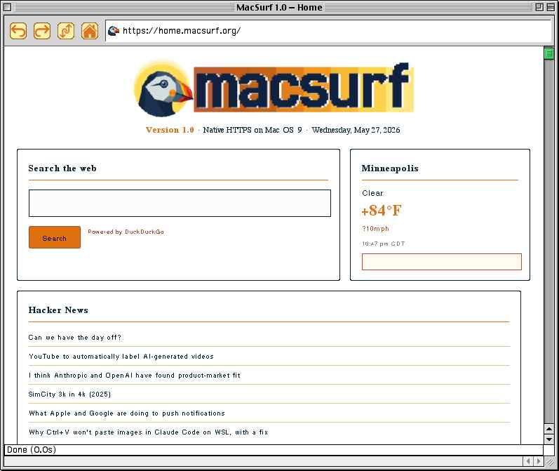

# MacSurf 1.0 — Showcase

**Released:** 2026-05-28
**Codename:** Showcase
**Engine HEAD:** fixes304
**Verified on:** Power Macintosh G3 iMac, Mac OS 9.1

---

## The headline

**The first full release.** Through 0.6 the question was "can this even speak modern TLS." Through 0.7 it was "can it render real sites without falling over." 1.0 is the answer to a different question: "does it actually feel like a real browser." It does.

Three things make this 1.0 and not 0.8:

1. **The image pipeline is correctness-clean.** Every rendering oddity that made 0.x feel like a tech demo — the blue tint on certain images, the "faded" mactrove logo, the white halos around toolbar buttons — was the same QuickDraw `CopyBits` colorizing behavior leaking the port's foreground color into every blit. fixes301j resets `fg=black / bg=white` before every image transfer; fixes301c marks fully-opaque PNGs as opaque so they take the colour-accurate `srcCopy` path instead of `CopyMask`. The result is true colors end to end on screenshots, transparent PNGs, JPEGs, and GIFs.
2. **The chrome looks like a real browser.** Toolbar redesign across fixes297–303 produced state-aware icons (disabled back/forward, animated reload, dim home at the home URL), invisible user-pane buttons, matted icon corners (no halos against the platinum toolbar), a razor-sharp 1px URL field, and a 1px `#555555` accent line separating chrome from page. Netscape-7-vibe "tool belt" rather than four chrome buttons floating on grey.
3. **A site we can show off on.** `home.macsurf.org` launched alongside the release — a server-rendered portal page (PHP, no JS dependency) showing weather, search, four news feeds, and a "Part of the MPLS LLC Network" widget. Rendered on a G3 iMac running OS 9.1, through `macTLS` direct, the [screenshot below](../../screenshots/macsurf-1.0-home.jpg) is the new default home and the headline image of the project.

The standards expansion is the other story of the release: 25+ CSS-related issues closed across a single Bundles A-M sprint (fixes272–281), bringing CSS direction (`rtl`), `@media (orientation)` / `(prefers-color-scheme)`, grid-auto-flow with dense, place-items / place-content, Logical Properties Level 1, extended cursor mapping, stacked-gradient first-layer rendering, narrow `calc()` arithmetic, and a repeating-gradient fallback. The CSS coverage count moved meaningfully without a single regression.

---

## Headline screenshot

`https://home.macsurf.org/`, served via `macTLS`, rendered with the fixes302–303 toolbar.

---

## What's *not* new

To keep the change log honest:

- **Native TLS 1.2 via macTLS** landed in **0.6**, not 1.0. Direct HTTPS to the origin, no proxy.
- **121-anchor Mozilla CA bundle** also 0.6.
- **The Carbon GWorld back-buffer**, image pipeline, libdom/libhubbub/libcss/libnsgif/lodepng integration, and the JS engine (Duktape ES5) all predate 1.0.

1.0 is a polish, correctness, and standards-coverage release on top of the working browser that 0.7 already was. The promise that earned 1.0 is "you can hand this to someone and it feels like a real browser."

---

## What landed (by area)

### Image rendering — correctness end to end

- **fixes301j — `RGBForeColor(black)` + `RGBBackColor(white)` before every `CopyBits` / `CopyMask`.** Classic QuickDraw colorizes the transfer with the port's current foreground color. The page had drawn blue link text just before plotting images, leaving the port fg blue; every image was tinted toward that. Diagnosed via a dest-readback probe that caught a black source pixel `[255,0,0,0]` landing in the composite as `[0,0,95,169]` — exactly the blue the user was seeing. Fix: two QuickDraw calls before the blit, the colorize becomes the identity transform. Same mechanism behind the long-standing "mactrove faded images" symptom.
- **fixes301c — Opaque PNGs take the `srcCopy` path.** `macos9_image.c` was unconditionally `set_opaque(false)` on every decoded PNG, forcing them through `CopyMask` even when they had no transparent pixels. Now both decoders (`macos9_png_decode_target` for display-size decode and `macos9_png_decode_to_bitmap` for natural decode) detect "no pixel has `alpha < 8`" → `has_trans = 0` → `set_opaque(true)` → plain `CopyBits srcCopy` (the path JPEGs use, proven colour-accurate).
- **fixes303 — Halo-free toolbar icons.** `macos9_decode_png_to_gworld` now writes `#D6D6D6` (the platinum toolbar grey) into every transparent pixel at decode time. The icon GWorlds carry the grey corner pixels natively; opaque `CopyBits srcCopy` blits them onto the toolbar without the white rounded-corner outline that previously framed every button.

### macintoshgarden.org compatibility

- **fixes300b — `nscss_screen_dpi` 90 → 96.** MacSurf inherited NetSurf's RISC-OS-era default. With `css_unit_css2device_px = css_px × device_dpi ÷ 96`, every CSS length was rendering at 90/96 = 93.75% of its CSS value. That shrank em-based containers out of sync with HTML `width=""` attributes and intrinsic image sizes; macintoshgarden's `#wrapper{width:59em}` resolved to 708px instead of 767px, leaving too little room beside its `float:right` sidebar, so the main-content `<table>` (a BFC that can't overlap a float) dropped *below* it and the page rendered with a blank content column. 96dpi = 1 CSS px : 1 device px (modern browser convention); all pages now render ~6.7% larger.
- **fixes299 — Non-destructive HTTPS auto-upgrade fallback (#140, #141).** Bare-domain URL typing now tries HTTPS first and falls back to HTTP if the TLS handshake fails. The mark stays in place for the main page fetch so sub-resource failures don't consume it before the main page itself can fall back. Closes #140 and the auto-upgrade half of #141.
- **fixes304 — URL-bar Enter bypasses the disk cache** (one-shot, same flag Reload uses). After editing a page server-side, re-typing the URL would have returned the stale cached HTML — now it always pulls fresh. Link clicks within a page still use the cache.

### Browser chrome — toolbar redesign

- **fixes294, fixes295 — Per-site favicons.** Phase 0: a static default puffin icon shown in the URL bar. Phase 1: real per-site favicon fetching for PNG and ICO (including PNG-inside-ICO and 32-/24-bit DIB-inside-ICO variants — the formats real-world `favicon.ico` files actually use).
- **fixes297 — State-aware toolbar icons.** Coloured icons when nav is available, greyed when not. Reload becomes an animated "loading" icon during page loads. Home icon dims when already at the home URL. Eight icon assets baked into the binary (24-bit RGBA PNG, decoded via lodepng).
- **fixes298 — Invisible user-pane buttons + Platinum toolbar.** Toolbar grew from 22 to 28 px tall, button slots became invisible user-pane controls so the icon paints directly on the platinum toolbar instead of through Carbon's chrome button. PtInRect click handling matches the new geometry.
- **fixes302 — Geometry, image masthead, Geneva text.** URL field aligned to the button vertical band on a unified horizontal baseline. Field width sized to leave a native-grey gap above and below. Text in Geneva 12, vertically centred past the favicon so it never touches the left bevel.
- **fixes303 — Tool-belt dense layout.** Buttons at a 34-px pitch (2-px gap), no per-button frames, no white halos (matted at decode time). URL field bevel reduced from 2 px sunken to a razor-sharp 1-px inset: `#444444` top + left, `#FFFFFF` bottom + right. 1-px `#555555` accent line at `y=content_rect.top-1` separates chrome from page.

### CSS standards expansion (Bundles A–M, fixes272–281)

A single-sprint standards round closing 25+ CSS issues. By bundle:

- **fixes272 (#35 + #49) — HTML `dir` attribute → CSS `direction`.** The HTML `dir="rtl"` attribute wires through to the libcss cascade as `direction: rtl`, then through to inline-flow direction in layout.
- **fixes273 (#52 + #74 + #76) — at-rules preprocessor + `@media (orientation)`.** Single-pass preprocessor that recognises `@layer`, `@supports`, `@media (orientation: …)`, `@media (prefers-color-scheme: …)` and dispatches each to the cascade correctly. `prefers-color-scheme: dark` matches when explicitly requested via a future user-preference flip; currently always-light by default.
- **fixes274 (#25 + #64) — CSS Grid V2 alignment** (`justify-items` / `justify-self` consumed in `layout_grid` track distribution).
- **fixes275 (#65) — `grid-auto-flow: row / column / dense`.** Dense packing finds the first empty cell that fits each auto-placed item, not just the next sequential slot.
- **fixes276 (#55 + #59) — Inline metrics.** `vertical-align: text-top / text-bottom / super / sub` and `line-height` as a unitless numeric multiplier.
- **fixes277 (#61) — CSS Logical Properties Level 1.** `inline-size` / `block-size`, `padding-inline-*` / `margin-inline-*` / `inset-*` map to their physical equivalents at the cascade preprocessor stage (LTR only — RTL inline-mapping is a later issue).
- **fixes278 (#79) — Extended cursor mapping** in `macos9_gw_set_pointer`: `pointer`, `text`, `wait`, `help`, `not-allowed`, `crosshair`, `move`, `progress`, plus the four `*-resize` and the four arrow cursors.
- **fixes279 (#27) — Stacked `background-image` fallback.** Comma-separated layered gradients (`linear-gradient(a), linear-gradient(b)`) now render the first layer instead of dropping the whole property at the trailing comma.
- **fixes280 — Narrow `calc()` arithmetic preprocessor.** Resolves `calc(100% - 20px)`-style expressions at cascade time for the cases that don't need a full expression tree (length ± length, length ± percentage on a known containing block).
- **fixes281 — `repeating-linear-gradient` / `repeating-radial-gradient` fallback.** Renders the platinum-grey solid placeholder instead of dropping the whole declaration. Cosmetic placeholder for what would otherwise be a blank area.

### Other rendering / chrome

- **fixes291 (#101) — `` alt-text fallback.** When an image content fails to fetch or decode, the layout box paints the `alt=""` text in the box's text style, with a 1-px dotted border to mark "image here, didn't load." Closes #101.
- **Merge #138 — HTML form `required` + `pattern` validation.** Patch from a community contributor. Form submit blocks on unmet `required` fields and unmatched `pattern` regex; offending inputs get a red 2-px error border.
- **Merge #139 — Integer overflow check in `libnsgif/gif.c`.** Same source, defensive cap on a width × height computation that could have wrapped on a malicious GIF. No known exploit; safety belt.

---

## Build state

- **Engine HEAD:** fixes304 (this release).
- **C source files in `MacSurf.mcp`:** approximately 487 (`.c` files) across NetSurf core, libdom, libhubbub, libcss, libparserutils, libnsgif, Duktape, lodepng, macTLS, and the macos9 frontend.
- **Combined LOC:** ~125 KLOC.
- **Compiler:** CodeWarrior 8 Pro + 8.3 update (Mac OS 9), strict C89.
- **Application partition:** 16 MB preferred / 8 MB minimum.
- **Linux cross-check:** Retro68 GCC PowerPC for syntax-only pre-flight on every fix round.

---

## Issues closed

Twelve in 0.7. **More than thirty** in 1.0. Pulled from `mplsllc/macsurf` issue closures since 2026-05-26:

| Area | Issues closed |
|---|---|
| **CSS standards (Bundles A–M)** | #25, #27, #33, #35, #49, #51, #52, #53, #54, #55, #57, #59, #60, #61, #64, #65, #74, #76, #79, #85, #86, #87, #89 |
| **Rendering / chrome** | #101 (alt-text), #112 (form validation), #4 (Grid V2), #8 (lazy decode), #2 (memory pressure), #5 (wheel-mouse crash, deferred), #18 (header audit), #28 (column-span), #26 (font-weight) |
| **Networking / cache** | #140 (HTTPS auto-upgrade), #141 (macintoshgarden — see follow-up below) |
| **Build / infra** | #12 (memory budget tracking) |

`#141 (Site compatibility: macintoshgarden.org)` is closed because the layout-and-cache headlines that blocked it (DPI 90→96 in fixes300b; URL-bar cache bypass in fixes304; HTTPS auto-upgrade in fixes299) all landed. Any remaining macintoshgarden-specific quirks should be filed as fresh, scoped issues rather than continuing to track under the original umbrella.

---

## New issues filed this round

- **#143 — ``: HTML `width=`/`height=` attributes and inline `style=` are ignored; only class-based CSS sizes the image.** Discovered while building `home.macsurf.org` — `` with `.foo { width: 245px }` honours the size, but `` and `` do not. The presentational-hint path for IMG (`node_presentational_hint` → `css_hint_width`) likely isn't reaching the cascade for this element type. Workaround: class-based sizing. The home page deliberately leans on class CSS for this reason.

---

## home.macsurf.org

Launched alongside the release. A server-rendered PHP portal showing:

- A DuckDuckGo HTML search form.
- Server-side weather (wttr.in, no API key, defaults to Minneapolis; cookie-based per-user override via a small "Change city" input).
- Four news panels, each cached server-side for 5-10 minutes:
  - **Hacker News** (https://news.ycombinator.com/rss)
  - **Macintosh Garden** (https://macintoshgarden.org/feed)
  - **Latest from MacSurf** (https://github.com/mplsllc/macsurf/commits/master.atom)
  - **Classic Mac Scene** (Hackaday's `/tag/macintosh/feed/`)
- A "Part of the MPLS LLC Network" widget linking to mactrove.com and mp.ls.

Class-based CSS only (works around #143 deliberately). No JavaScript dependency. Renders identically in MacSurf and in a modern browser; the screenshot above is the canonical MacSurf-side hardware render.

---

## Known limitations

- **`` width / height / inline style sizing** — see #143 above.
- **DuckDuckGo subsequent searches** — searching from the home page reaches DDG correctly and renders results, but submitting another search **from** DDG's own results page does not work. Likely a form-submission interaction worth a fresh issue; deferred for the next cycle.
- **Google Fonts CDN** stays in the dead-host fast-fail list (no ALPN in macTLS yet → `fonts.googleapis.com` connection times out, gets blocklisted, subsequent fetches skipped). Tracked under #92.
- **Wheel-mouse crash** (USB Overdrive interaction) remains user-environment-dependent. Defensive disable continues to hold; #5 is closed pending hardware reproduction.

---

## How to run

The asset attached to the release (`MacSurf.sit`) unpacks to a Carbon CFM application. Drop it on Mac OS 9.1 or 9.2.2 (PowerPC G3 or G4 recommended, 64 MB minimum), double-click. The home page is bookmarked as the default; from there, browse anywhere.

Source: <https://github.com/mplsllc/macsurf>. Read the [README](../../README.md) for the build-from-source flow and the [status](../status.md) for what's working and what isn't.

---

*MacSurf 1.0 — Showcase. The puffin came home.*
