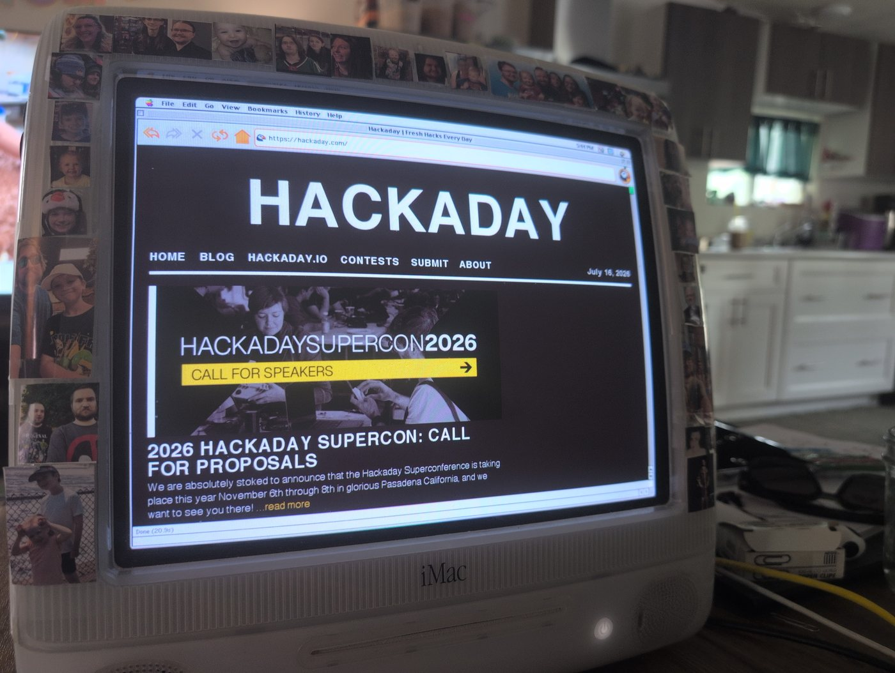
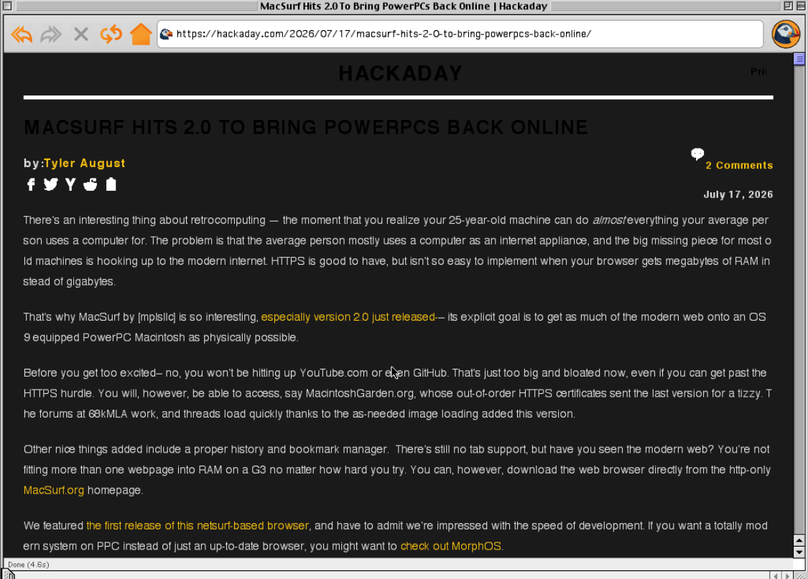
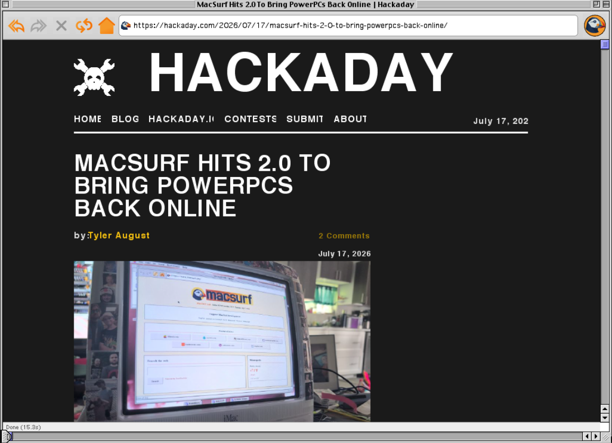
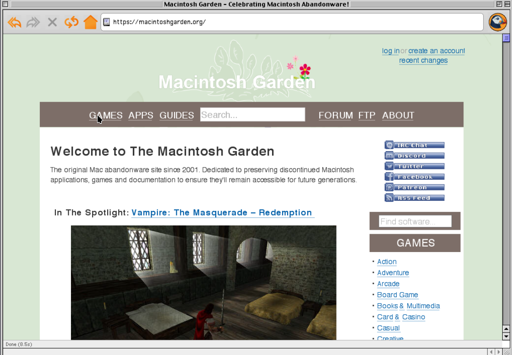

  

# MacSurf 2.0.5 "HACKADAY"

A polish release. 2.0 got MacSurf onto real Macs and rendering the modern web — 2.0.5 is the batch of fixes and CSS work that makes those pages actually look *right*. No new setup, nothing to configure. Drop it in over 2.0.

## The headline: Hackaday renders

Point MacSurf at **hackaday.com** and the article front page comes up — at real desktop width, with the correct fonts, the article cards laid out, the images in place. A big, modern, JavaScript-heavy news site, rendering on a G3. That is what this release is named for, and a stack of work sits under it: a browser-wide text-size fix, a large modern-CSS pass, a much more capable on-device JavaScript engine, and blocking the tracker/ad junk that used to eat the page before the content ever loaded.

(Honest about it: this is about pages *rendering* — coming up correct and readable. Deep in-page interactivity on the heaviest sites is still being built. But blank, squished, and unstyled are largely behind us.)

## The big wins

**Text is the right size again — everywhere.** The quiet fix that mattered most. Every author `font-size` in the browser was drawing about 25% too small, and CSS `em`/`rem` units and `@media` width queries were all computing against the wrong number — which is why so many sites came up cramped into a narrow column instead of laying out at full desktop width. Fixed at the root: MacSurf now measures type in real device pixels, like every other browser.

<table>
<tr><td width="50%"></td><td width="50%"></td></tr>
<tr><td align="center"><em>Before — text 25% too small, no masthead logo</em></td><td align="center"><em>After 2.0.5 — correct type, the logo and images render</em></td></tr>
</table>

**Trackers and ad networks are blocked.** Known analytics and ad hosts (Usercentrics, Supplyframe, WP stats, Cloudflare beacons and the like) are refused before they load. On a heavy page that's a real chunk of fetching and script-running the Mac used to grind through for nothing.

**Hacker News works.** You can log in, and the front page renders close to a desktop browser — the orange logo, the vote arrows, no phantom boxes around every story.

**Pages read the way they should.** Plain-text and status pages show in the window instead of trying to download themselves. Squished-into-a-strip images come in at the right shape. More JPEGs decode instead of drawing black boxes, and a photo too big for memory shrinks to fit instead of vanishing. See-through (rgba) backgrounds blend against what's behind them instead of always assuming white. And white text on a dark background stays white, instead of being forced to black and disappearing.

**Typing is fast again.** Typing into a comment box or login form on a big page used to stutter — every keystroke redrew the whole page. Now it repaints only the bit that changed, which also makes the cursor, hover effects, and small scrolls snappier.

**A large jump in CSS.** MacSurf now handles a cluster of modern layout and text features it didn't before — several that no other classic-Mac browser has done, and a few the upstream NetSurf engine doesn't ship either:

- Justified text that spreads words to both margins
- Soft hyphens — long words break with a "-" at the line end
- `tab-size`, so code and pre-formatted text line up
- Flexbox cross-axis alignment, and the box-alignment shorthands (`place-items`, `place-content`, `place-self`)
- CSS Logical Properties (`margin-inline`, `padding-block`, `inset-*`)
- Grid columns that auto-size to their content
- Smaller touches: `caret-color`, `text-decoration` color/style/thickness, `text-align-last`, and a real `background: none` reset

**A more capable JavaScript engine.** Under the Hackaday headline is a long run of engine work: real `fetch()` and `XMLHttpRequest` backed by the network, Promise chains that resolve past their first step, `document.cookie` wired to the real cookie jar, real DOM traversal and `querySelector`, and the document load lifecycle (`readyState`, `DOMContentLoaded`, `load`) behaving the way pages expect.

## Closed issues

Closes #62, #201, #212, #227, #230, #232, #234, #235, #239, #244, #247, #249, #251, #252, #253, #268, #270, #271, #272, #273, #275, #276, #277, #278, #282, #283, #284, #285, #286, #287, #288, #289, #291, #292, #293, #294, #295, #296, #297, #298, #300, #301, #302, #304.

Partial (the headline sub-feature shipped, remainder still tracked): #255 (`background-clip` box values; `background-clip:text` deferred), #256 (`image-rendering`; `box-decoration-break` deferred), #279 (`justify-items`; Grid Round 2 placement/minmax open), #280 (``; CSS `background:url(*.svg)` open).

## Seen on real hardware

XenForo forums like **68kMLA** render, log in, and stay logged in — the correct text size and the modern-CSS work land the whole layout:

<table>
<tr><td width="50%"></td><td width="50%"></td></tr>
<tr><td align="center"><em>Before</em></td><td align="center"><em>After 2.0.5 — logged in, correct type</em></td></tr>
</table>

And **macintoshgarden.org** — image-heavy and fully styled — over a secure connection handled on the Mac itself:

  

## To run

Expand the archive with StuffIt Expander and double-click MacSurf. No installer, no configuration. Requires a Power Macintosh (G3 or G4), Mac OS 9.1–9.2.2 with CarbonLib 1.5+, and **128 MB of RAM minimum — 256 MB recommended, 384 MB for the heaviest JavaScript sites**. (The modern JavaScript engine and CSS layout need real headroom; 64 MB is no longer enough for a usable modern-web experience.)

Thanks to everyone testing on real hardware and filing issues — every fix above came from a report on an actual G3/G4.
