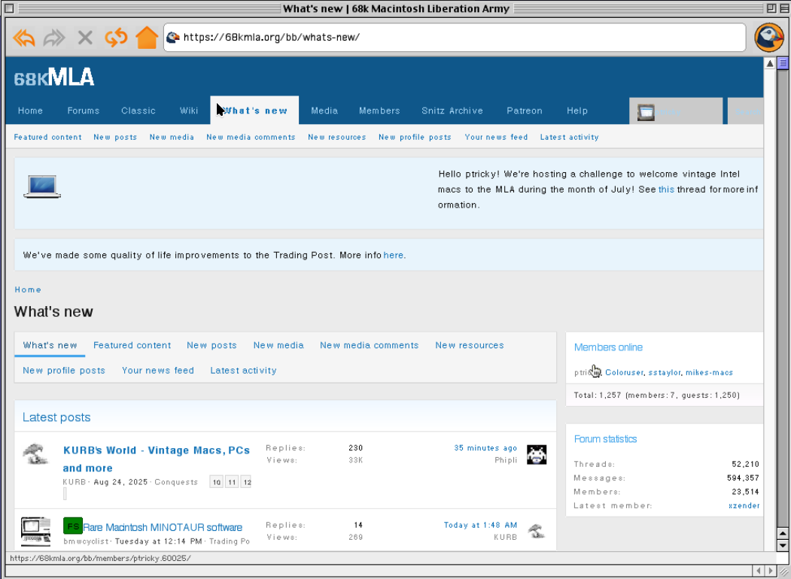
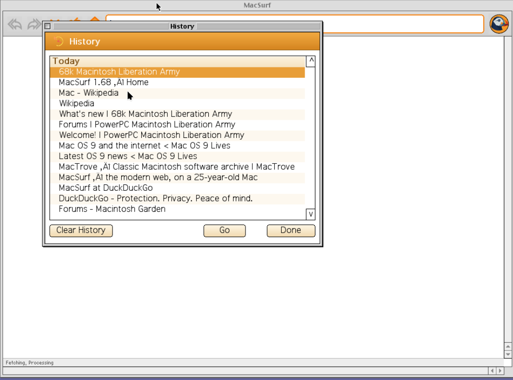
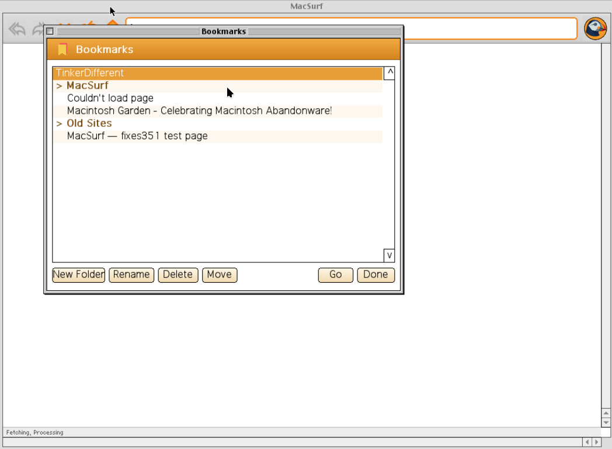
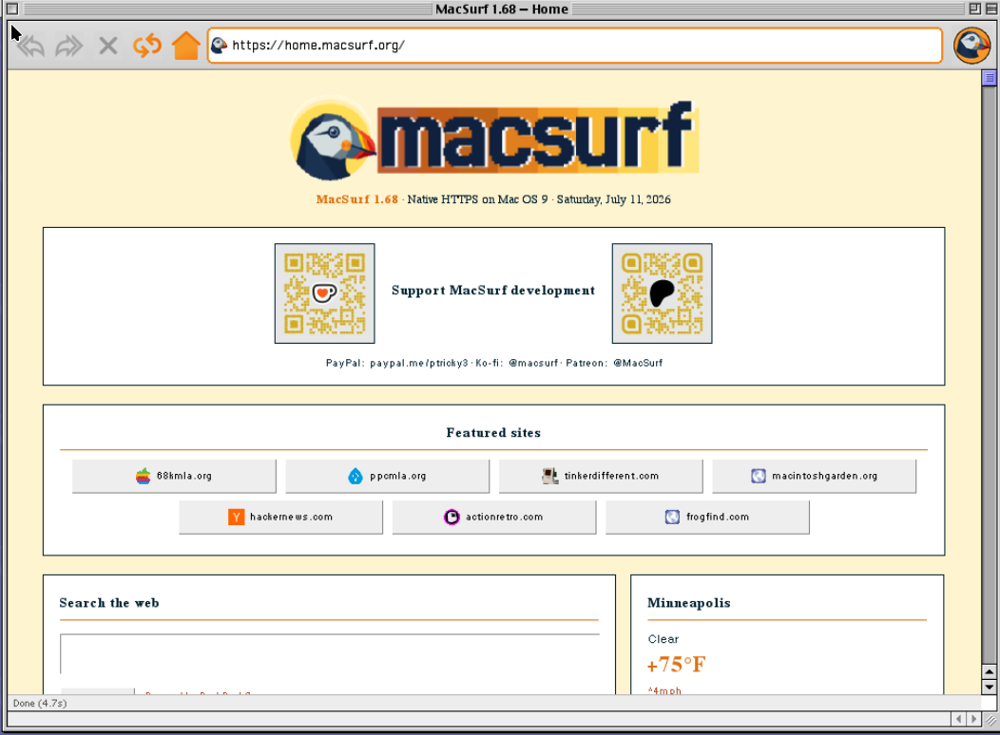
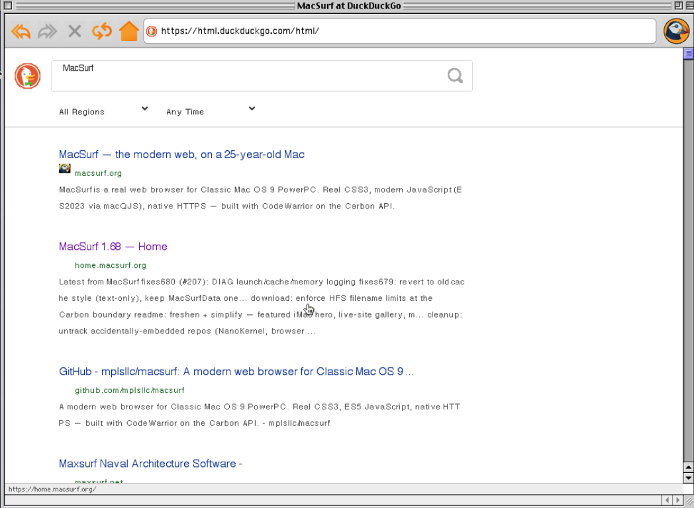

  

# MacSurf 2.0 🎉

**Prettier. Faster. Puffin‑er.**

A native web browser for Classic Mac OS 9 on PowerPC — real CSS3, a modern JavaScript engine, and native HTTPS, running on a 25‑year‑old Mac. No proxy. No second machine. Just your G3 or G4 and the live web.

This is the biggest release yet. The blank‑screen bug that bit our highest‑RAM machines is **gone**, a whole class of HTTPS sites that used to fail now load, heavy forums come up in seconds instead of minutes, and the browser itself got a real glow‑up — new toolbar, address‑bar autocomplete with a suggestions dropdown, and proper History and Bookmark managers.

---

## ☕ Help keep MacSurf going

MacSurf is a full‑time, one‑person project. Bringing the modern HTTPS web back to real Mac OS 9 hardware is a *lot* of work, and it only keeps moving at this pace if it can pay its own way. If MacSurf put your old Mac back on the web, please consider chipping in — every bit genuinely helps, and supporters get the dev logs and a say in what comes next.

  <a href="https://ko-fi.com/macsurf"><b>☕ Ko‑Fi → ko-fi.com/macsurf</b></a>
  &nbsp;&nbsp;·&nbsp;&nbsp;
  <a href="https://www.patreon.com/cw/MacSurf"><b>❤️ Patreon → patreon.com/cw/MacSurf</b></a>
  &nbsp;&nbsp;·&nbsp;&nbsp;
  <a href="https://discord.gg/mrwZK8zHr2"><b>💬 Discord</b></a>

*Huge thanks to our supporters — **Shlooom** on Patreon, **kilgeist** and **Turuun** on Ko‑Fi. You make this possible.*

---

## ✨ The showstoppers

### 🖥️ The blank screen on launch is fixed — the big one
If MacSurf ever opened to an empty window on a maxed‑out Mac (and clearing the cache only "fixed" it for a while), **2.0 repairs that for good, automatically, the first time you launch it.** Two real root causes, both nailed down: a set of hardcoded "valid‑pointer" address ceilings that quietly rejected legitimate memory on higher‑RAM Macs (breaking string interning, so no fetcher ever matched and the page came up blank), and a "dead host" list that was being saved to disk with no expiry — one bad network moment could condemn your home page to a blank window forever. MacSurf now reads its *actual* partition bounds from the system at runtime, and the dead‑host list lives only for the current session. *Reproduced on demand on a maxed‑RAM machine, then fixed and verified.* (#207)

### 🔒 More of the HTTPS web loads — hello, macintoshgarden.org
MacSurf's native TLS 1.3 stack was strict about certificate‑chain ordering — and a lot of servers (the whole Sectigo / USERTrust cross‑signed family, **macintoshgarden.org** among them) send their chains out of order and trust the browser to sort it out. Now MacSurf does: it parses each certificate, reorders the chain leaf‑first, drops the ones that don't link, and falls back gracefully if anything looks off. A big batch of sites that used to bounce to plain HTTP now open securely on the Mac. *G3‑verified.* (#206)

### ⚡ Heavy forums load in seconds, not minutes
Viewport‑gated lazy image loading now covers **every** image on the page, not just the ones marked `loading="lazy"`. Off‑screen images wait until you scroll to them, so a busy 68kmla forum thread with a multi‑megabyte attachment dropped from **20 seconds–2 minutes down to about 3–6 seconds.** *G3‑verified.* (#223)

### ⌨️ A type‑ahead address bar with a suggestions dropdown
Start typing a site you've been to and MacSurf finishes the address for you from your history — and drops down a list of the other matches. Arrow through them, click one, or just hit Return. (#231)

### 📚 Real History and Bookmark managers
A persistent, clearable, **day‑grouped History** window (⌘H) with its own store, and a full folder‑based **Bookmark manager** (⌘B) with New Folder / Rename / Delete / Move / Go and drag‑and‑drop. The Bookmarks menu nests your folders as submenus.

  
  &nbsp;
  

---

## 🧩 Everything new in 2.0

**Works on more Macs**
- **Blank screen on launch — fixed** (runtime partition bounds + session‑only dead‑host list). MacSurf even cleans up a poisoned list an older version left behind. (#207)
- **Version shows in Finder's Get Info** — new `'vers'` resource, so Get Info reads "MacSurf 2.0" instead of "N/A". (#219)
- **Cleaner out‑of‑memory behavior** and the 32 MB memory cache restored, now that the blank‑page cause is confirmed.

**Reaches more of the web**
- **Cross‑signed / out‑of‑order HTTPS chains validate** — macintoshgarden.org and many more. (#206)
- **Stickier logins** — cached pages are refreshed on login, so you don't get bounced back to a logged‑out view. (#213)
- **`[hidden]` elements are correctly hidden.** (#114)

**Faster**
- **Viewport‑gated lazy image loading for all images.** (#223)
- **Image "reflow storm" eliminated** — avatar‑heavy pages used to re‑lay‑out the whole document for every image that finished; reflows fell from ~15 to 2–4 on a typical forum page. (#208)
- **Snappier JavaScript** — less event‑loop overhead during scripts; `querySelector` stops at the first match. (#209, #210)
- **Typing latency fixed** — each letter now paints the instant you press it, instead of waiting behind a still‑loading page. (#212)

**Nicer to use**
- **A refreshed interface** — new toolbar with a soft gradient and bevel, a pill‑shaped URL bar with an orange focus ring, a Netscape‑style animated throbber, a page‑load progress bar, a refined status shelf, a fresh nav‑icon set, hover highlighting, and an animated "space‑glass" About box.
- **URL type‑ahead + suggestions dropdown.** (#231)
- **History manager** (⌘H) with a Clear Cache menu item. (#47)
- **Bookmark manager** (⌘B) with folders and drag‑and‑drop. (#221)
- **Horizontal scrolling in the address bar** for long URLs. (#229)
- **Clipboard, favicon, and Apple‑menu fixes** — multi‑line copy uses proper Mac line endings, favicons stopped tinting, and the duplicated Apple menu is gone.

**Under the hood**
- Native **TLS 1.3** via [macTLS](https://github.com/mplsllc/macTLS) (BearSSL + the full Mozilla CA bundle).
- Modern **ES2023 JavaScript** via [macQJS](https://github.com/mplsllc/macQJS) (QuickJS), on‑device.
- Built on the [NetSurf](https://www.netsurf-browser.org/) engine, in C89 with CodeWarrior 8 on the Carbon API.

---

## ⬇️ Get it

**Download the `.sit` from the [latest release](https://github.com/mplsllc/macsurf/releases/latest)**, expand it with StuffIt Expander, and double‑click **MacSurf**. No installer, no configuration.

Already on a Mac OS 9 machine? Grab it straight from the browser at the **plain‑HTTP** edition of the site — **http://macsurf.org/** — no other computer needed.

**Requirements**
- Power Macintosh (G3 or G4)
- Mac OS 9.1 – 9.2.2 with CarbonLib 1.5+
- ~64 MB RAM (more helps on heavy pages)

---

## 🙏 Honest limitations

This is real, in‑progress software, and we'd rather tell you than have you find out:

- Very heavy modern apps — GitHub, YouTube, big React SPAs — still don't render.
- Tab reaches form fields but not yet links or buttons.
- Tabs (several pages in one window) aren't enabled yet.
- A few sites hit image‑decode quirks (some progressive JPEGs) and cosmetic layout gaps.

Got a G3 or G4? Load it up and tell us what breaks — [open an issue](https://github.com/mplsllc/macsurf/issues) with your **MacSurf Debug.log** attached and it genuinely helps.

---

## 💛 Thank you

Special thanks to **@glossolallia**, **@CaptainPanic29**, and **@Azryael** on GitHub and **@SandwichEnthusiast7** on Reddit for the detailed bug reports, crash logs, and hardware verification on real G3 and G4 machines that made this cycle possible — the blank‑screen bug in particular could not have been isolated without you.

And thank you to **[68kmla.org](https://68kmla.org)** — the 68k / PowerPC Mac community that has been so kind and welcoming, tested MacSurf every single day, and shaped this whole stretch of work. Getting your forums to render, log in, and post a reply from a real Mac OS 9 machine has been one of the most rewarding things to build toward.

---

<i>Native HTTPS via macTLS · JavaScript via macQJS · built on NetSurf</i>

<a href="https://www.patreon.com/MacSurf/posts/this-is-for-gary-163164919">For Gary &amp; Kaija</a>

