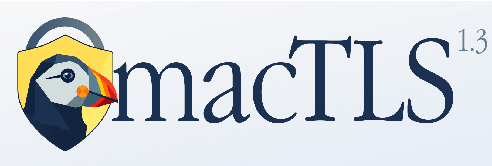

<p align="center"></p>

# macTLS

Native TLS 1.2 **and TLS 1.3** for Classic Mac OS 9. macTLS lets a PowerPC Mac running OS 9 open a real, modern HTTPS connection on its own, validate the certificate chain, and read back the decrypted bytes. No proxy, no helper machine, no stripping TLS somewhere upstream. The handshake happens on the Mac.

It's verified end to end on a real Power Macintosh G3 running OS 9.1, and it ships inside [MacSurf](https://github.com/mplsllc/macsurf), which uses it for every `https://` page it loads. **As of 2026-05-29 macTLS speaks TLS 1.3.** It's not a side experiment: the 1.3 path is wired into the same async API MacSurf calls (`OSTLS_New / Start / Pump / Write / Read`), so a normal fetch negotiates 1.3 automatically and falls back to 1.2 when a server doesn't offer it. Verified on the G3 driving the public API: a 1.3 handshake, an HTTP request, and the full decrypted response over Open Transport against Google (ChaCha20-Poly1305, suite `0x1303`). As far as we can tell, that's the first time TLS 1.3 has run natively on Classic Mac OS.

## What it does

A typical TLS 1.2 fetch negotiates `TLS_ECDHE_ECDSA_WITH_CHACHA20_POLY1305_SHA256` (suite `0xCCA9`). That's a modern, forward-secret suite, and ChaCha20 is the right pick for a CPU with no AES hardware. macTLS validates the server's chain against the full Mozilla root set (121 anchors baked in at build time), checks the hostname and expiry against the Mac's clock, and hands you the plaintext. It works against Google, and against any HTTPS site whose chain ends at one of those roots.

The TLS 1.3 path negotiates `TLS_CHACHA20_POLY1305_SHA256` (`0x1303`) or `TLS_AES_128_GCM_SHA256` (`0x1301`) with X25519 key exchange, validating the chain against the same anchors. It's a hand-written 1.3 handshake (state machine, key schedule, and record layer per RFC 8446) that borrows BearSSL only for primitives — X25519, the AEADs, HKDF/HMAC/SHA-256, and the X.509 validator — because BearSSL itself has no TLS 1.3 and never will. Every connection opens with a 1.3 ClientHello that also advertises 1.2 suites; if the server picks 1.3 the hand-written path runs the connection, and if it declines, macTLS reconnects and lets BearSSL's engine drive a full 1.2 handshake. The switch is invisible to the caller — `OSTLS_Read` / `OSTLS_Write` return the same plaintext either way. Server authentication only for now; client certs, 0-RTT, and 1.3 session resumption are out of this first cut (1.2 session resumption works).

Under the hood it's a thin layer of glue (a few KB) sitting on vendored BearSSL for the crypto and Open Transport for the sockets.

## Two ways to call it

**Blocking (v0.1).** One function. Link it in and call it:

```c
OSErr OSTLS_Fetch(
    const char *host,           /* "google.com"                     */
    UInt16      port,           /* 443                              */
    const char *server_name,    /* SNI + cert hostname match        */
    const char *path,           /* "/" or "/api/v1/whatever"        */
    void       *out_buf,        /* your buffer for the response     */
    UInt32      out_cap,        /* size of out_buf                  */
    UInt32     *out_len,        /* bytes actually copied (optional) */
    char       *out_msg,        /* status string                    */
    UInt32      out_msg_len);
```

It returns once the handshake is done, the request is out, and the response is captured. The UI freezes for the couple of seconds that takes, which is fine for a quick fetch but not for a browser.

**Async stream (v0.2, hardware-verified).** A socket-like surface that never blocks:

```
OSTLS_New / OSTLS_Start / OSTLS_Pump / OSTLS_Write / OSTLS_Read / OSTLS_Close / OSTLS_Dispose
```

You drive it from your event loop. Each `OSTLS_Pump` does a bounded amount of work and returns, so the host stays responsive. This is what MacSurf uses. Stage D1 (async OT plumbing) and Stage D2 (full async handshake plus chunked read) both pass on real hardware.

## Entropy: macEntropy v1.0

A TLS library is only as trustworthy as its random numbers, and on a machine with no hardware RNG this is the part that took the most care to get right.

macEntropy is the production seeding subsystem, hardware-validated on a G3 in May 2026. It keeps a running SHA-256 pool that everything jittery gets folded into: the high-res clock, mouse movement, stack noise, the arrival timing of every network packet during a fetch, and (when a host wires it up) live mouse and keystroke timing from the event loop. Seeds come out with domain separation and get folded back in, so no two are the same. A seed file in the Preferences folder carries entropy across reboots, which keeps the very first handshake after a cold boot from running on a thin pool.

That seed feeds BearSSL's HMAC-DRBG. macTLS supplies the entropy, BearSSL runs the generator. The built-in self-test checks for degenerate output and, more to the point, confirms the seed stream is different on every launch. Earlier builds shipped a weak placeholder seed and said so loudly in the docs. That's gone now.

The full plan and stage-by-stage status live in [MACENTROPY_SCOPE.md](MACENTROPY_SCOPE.md).

## Compatibility policy: MacSurf comes first

macTLS is built to drop into any Classic Mac OS app that needs a secure socket (a mail client, an FTP or SSH client, whatever comes next). But it isn't a neutral library with no opinions. MacSurf sits at the top of the compatibility list, and every default and hard limit is set by what MacSurf needs:

- **CW8 C89.** Everything compiles clean under CodeWarrior 8 in C89. If a change helps another toolchain but breaks CW8, it doesn't land.
- **16 MB Carbon partition.** Per-connection footprint stays inside what MacSurf can spare, around 50 KB a connection.
- **Cooperative, no threads.** The `Pump` model fits a `WaitNextEvent` loop. Other hosts adapt to that, not the reverse.
- **No new dependencies.** Vendored BearSSL plus the Toolbox, nothing else.

Consumers pin macTLS at a known-good commit. The version MacSurf builds against only moves forward after it's verified on real G3 hardware, so "MacSurf first" is something the process enforces, not just a line in the README.

## How it's wired

```
your app          OSTLS_Fetch(...) or OSTLS_New/Pump/...
  |
  v
macTLS            this repo, a few KB of glue
  |
  +--> BearSSL    vendored at 7bea48e5, ~250 .c files, MIT.
  |                 i31 bigint, X25519, ChaCha20-Poly1305,
  |                 SHA-256, minimal X.509 validator.
  |
  v
Open Transport    OTConnect / OTSnd / OTRcv
  |
  v
remote HTTPS server
```

Per-fetch memory is around 50 KB: one `br_ssl_client_context`, one `br_x509_minimal_context`, and a 33 KB I/O buffer. That fits inside a 16 MB Carbon partition with plenty to spare.

## Why a library and not a proxy

The first design was a local proxy on `127.0.0.1:8765` that any old browser could point at. Carbon CFM won't allow it: `OTOpenEndpointInContext` endpoints can't bind to a caller-chosen address. Fourteen rounds of probing nailed that down (the writeup is in [docs/carbon-ot-passive-bind-finding.md](docs/carbon-ot-passive-bind-finding.md)). The library shape works around the platform limit, and it's the better design anyway. One function call, no daemon, no port to configure.

## Repo layout

```
os9/                          OS 9 integration, in the build
  ostls_fetch.{h,c}             blocking public API
  ostls_async.{h,c}             async stream public API (v0.2)
  ostls_http.{h,c}              HTTP helpers (chunked decode, request format)
  ostls_entropy.{h,c}           macEntropy v1.0 seeding
  ostls_b3_anchors.{h,c}        121 embedded Mozilla trust anchors
  ostls_b3_handshake.{h,c}      validated handshake (internal)
  ostls_time.{h,c}              OS 9 clock -> BearSSL date
  ostls_log.{h,c}               file-backed log channel
  ostls_cw8_prefix.h            CW8 language workarounds
  ssl_engine_cw8.c              C89-patched copy of BearSSL's ssl_engine.c
  ostls_b1/b2/smoketest/mul64   diagnostic-stage probes
  archive/                      historical, not in the build

bearssl/                      vendored upstream (commit 7bea48e5)
MacTLSTest/                   Carbon CFM regression harness
docs/                         design notes, run logs, investigations
MACENTROPY_SCOPE.md           the macEntropy build plan and status
tools/regenerate_anchors.sh   rebuild the trust-anchor source from PEMs
```

## Building

CodeWarrior 8 Pro on real Mac OS 9. Add `bearssl/src/**/*.c` (skip `bearssl/src/ssl/ssl_engine.c`, since `os9/ssl_engine_cw8.c` replaces it), all of `os9/ostls_*.c`, `os9/ssl_engine_cw8.c`, and `MacTLSTest/main.c` to a Carbon CFM PPC project. Prefix file: `MacTLSTest/mactlstest_prefix.h`. Access paths: every `bearssl/src/` subdirectory (CW8 doesn't recurse), plus `bearssl/inc/`, `os9/`, and `MacTLSTest/`. Libraries: `MSL_C_Carbon.Lib`, `MSL_Runtime_PPC.Lib`, `MathLib`, `CarbonLib`. Partition: 16 MB preferred, 8 MB minimum.

For Linux-side syntax checks during development, [Retro68](https://github.com/autc04/Retro68) GCC with `-std=c89 -pedantic-errors` does the job.

One CW8 quirk worth knowing: if you compile a macTLS `.c` from a project that doesn't have `os9/` on its include access path, the same-directory `""` includes can silently miss, and you'll get implicit-int link errors. The `.c` files forward-declare their own exported API to stay safe either way. Adding `os9/` to the include paths is the clean fix.

## Other classic-Mac TLS work

macTLS didn't come out of nowhere. A few related projects:

- [**Certainly**](https://github.com/minorbug/certainly) (minorbug, MIT): BearSSL over Open Transport on the Retro68 toolchain, TLS 1.3. Closest sibling, and the basis for macTLS's own 1.3 — we adapted its hand-written `tls13_*` handshake, key schedule, and record modules from C99/Retro68 to CodeWarrior 8 C89, wired them to macTLS's OT pump, macEntropy, and anchor bundle, and fixed a couple of bugs along the way (its ChaCha20-Poly1305 decrypt skipped the auth-tag check; we added a constant-time compare). Attribution is in the source of the ported files.
- [**MacTLS** (bbenchoff)](https://github.com/bbenchoff/MacTLS): an mbedtls/PolarSSL port to CodeWarrior Pro 4 for Mac OS 7/8/9. First public proof that CodeWarrior plus classic Mac plus TLS works at all. Frozen since 2024, TLS 1.1, one hardcoded site. The name collision is a coincidence, separate projects.
- [**Crypto Ancienne**](https://github.com/classilla/cryanc) / `carl` (Cameron Kaiser): a TLSe-based proxy tool that runs under MPW, known to work with Classilla. Different runtime model (an MPW shell tool, not a Carbon library), but it shows old browsers can drive a local HTTPS helper if there's one to drive.

## Status and tags

- **v0.1.0** (2026-05-19): working blocking `OSTLS_Fetch`, verified on G3 / OS 9.1.
- **v0.2.0**: non-blocking async stream API, code complete and passing Stage D1 + D2 on hardware. TLS 1.2 session resumption (abbreviated handshake) verified on hardware.
- **macentropy-v1.0** (2026-05-29): production entropy, hardware-validated and folded into MacSurf, so MacSurf's HTTPS runs on it.
- **TLS 1.3** (2026-05-29): live through the async public API. On a real G3, `OSTLS_New / Start / Pump / Write / Read` negotiates TLS 1.3 against Google, sends an HTTP request, and reads back the full decrypted response over Open Transport (ChaCha20-Poly1305, suite `0x1303`), with automatic fallback to 1.2. The handshake, key schedule, and record layer also pass the RFC 8446/8448 test vectors on host and on-device. The plan and stage log are in [TLS13_SCOPE.md](TLS13_SCOPE.md).

What's next, roughly in order: the v0.3 HTTP conveniences (redirect following and POST bodies are partly in already); 1.3 session resumption (PSK/tickets), which is what finally gives resumption against the big CDNs; then more downstream consumers beyond MacSurf.

## License

MIT, see [LICENSE](LICENSE). BearSSL is also MIT, vendored under `bearssl/` with its own license file. Nothing else third-party is statically linked into the build.
