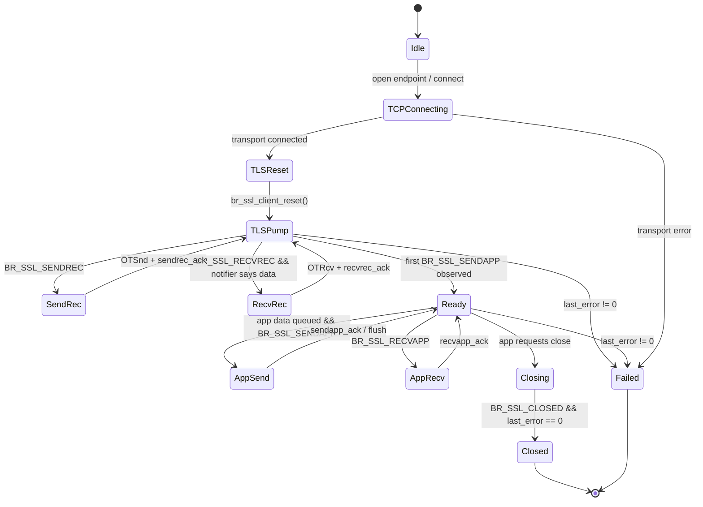
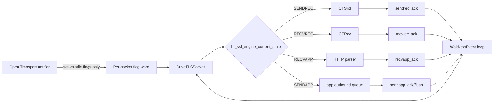

# Native Mac OS 9 TLS Infrastructure

## Executive summary

The shortest path to a **native, browser-usable Mac OS 9 TLS stack** is **not** to write a cryptographic engine from scratch. The best-fit foundation is BearSSL, because its published API is already organized around a **generic nonblocking SSL engine** with caller-driven I/O channels (`sendapp`, `recvapp`, `sendrec`, `recvrec`), caller-provided buffers, and caller-allocated contexts. In other words, the “cooperative state machine” you want is **mostly already present** in BearSSL’s public architecture; what Mac OS 9 needs is a **thin Open Transport and event-loop wrapper** around BearSSL’s generic engine, not a wholesale reinvention of the handshake. BearSSL’s public header also documents protocol constants only through **TLS 1.2**, so if a project named **Certainly** really provides Retro68-targeted TLS 1.3 on top of BearSSL, it is likely a fork or substantial wrapper rather than a stock upstream capability and should be treated as a promising lead to verify, not as an assumed upstream feature. citeturn57view0turn57view1turn22view0turn59view0

For the build and runtime environment, the safest recommendation is to use **Retro68** for the crypto core and browser integration, not MPW/MrC. Retro68 is a GCC-based cross-compilation environment for both classic 68K and PowerPC Macs; it ships PPC targets, PEF tooling (`MakePEF`, `MakeImport`), import-library support, and an automated test harness. By contrast, Cameron Kaiser’s cryanc project explicitly warns that **MrC generates verifiably incorrect code** on cryptographic workloads when optimization is enabled, forcing de-optimization and materially harming performance. That warning alone is enough to keep MPW/MrC out of the trusted build path for a native TLS library. citeturn35view0turn35view2turn35view3turn54view0turn54view3

Performance work should be staged. Before writing a line of PowerPC assembly, you should first exploit the optimization BearSSL already exposes at the algorithm-selection layer: its benchmark data shows that specialized curve implementations such as `p256_m31` and `c25519_m31` substantially outperform the generic `prime_i31` and `c25519_i31` families, and that dedicated architecture-specific symmetric code can be dramatically faster than generic constant-time C. On platforms with no modern crypto opcodes, the realistic near-term goal is not “POWER8-class acceleration,” but a layered plan: **specialized curve selection first, integer-kernel tuning second, AltiVec bulk-cipher work third**. citeturn63view0turn60view1turn61view2turn61view3

Security and privacy work must be local-first. The existing 68k mbedTLS port is candid that classic Macs do not have a modern **root certificate library**, and that missing entropy is a serious security problem. BearSSL’s X.509 API gives you the right primitives for a native fix: a **local trust-anchor store**, a **minimal X.509 validator**, and a **known-key mode** for SSH-style direct trust or pinning. That means a clean Mac OS 9 design is practical: ship a curated local CA bundle, support user-approved direct trust for self-hosted systems, and make revocation updates an explicit offline artifact rather than a silent network side channel. citeturn64view0turn68view0turn69view0turn69view3

## Architectural baseline and the codebases worth studying

The codebases below are not equally important. For this project, they fall into three tiers: **BearSSL and Retro68** are foundational; **MacHTTP, mbedtls-Mac-68k, cryanc, and TLSe** are comparative reference implementations; **Certainly** is a high-priority lead that still needs independent verification.

| Project | What is publicly verified | Why it matters to this OS 9 TLS project | Bottom-line value |
|---|---|---|---|
| BearSSL | Generic nonblocking SSL engine, caller-provided buffers, caller-managed session cache storage, specialized EC implementations, compile-time constant-time multiply switches | Best architectural fit for cooperative classic Mac networking and tight memory control | Primary crypto core |
| Retro68 | GCC-based toolchain for classic 68K/PPC, PPC target, PEF tools, import stubs, automated tests | Best available modern toolchain for a native CFM/PEF deliverable | Primary build system |
| mbedtls-Mac-68k | 68k port; 33 MHz 68040 handshake about 15 s; no entropy source; no root cert library | Concrete evidence of vintage-handshake bottlenecks and missing trust/entropy infrastructure | Performance/warning reference |
| MacHTTP | Simple Retro68 HTTP/HTTPS client using mbedtls-Mac-68k and MacTCPHelper; includes `size.r`; one open PR visible on repo page | Shows what a small client surface looks like on classic Mac OS and reminds you that classic apps need explicit resource sizing | Integration reference |
| cryanc | “TLS for the Internet of Old Things”; classic Mac OS MPW notes; cooperative multitasking; MrC miscompile warning; high stack warning | Best public catalog of “don’t do this blindly on vintage Macs” compiler and stack pitfalls | Pitfall reference |
| TLSe | Single-file TLS implementation; client-side TLS 1.3 marked experimental; DTLS state-machine caveat | Useful as a compact comparative design, especially for serialization simplicity | Secondary comparative baseline |
| Certainly | I could not independently verify a public repository or accessible announcement in the web indexes available to me on May 18, 2026 | If real, it is potentially the fastest route to TLS 1.3 on Retro68/BearSSL-style foundations | Priority lead to verify manually |

The verified rows in that table come directly from the projects’ own public documentation. BearSSL’s API overview and headers describe the generic engine, buffer model, and session-cache storage model; Retro68’s README documents GCC-based PPC support, PEF tooling, and automated tests; the mbedTLS and MacHTTP repos describe their classic-Mac ports and dependencies; cryanc documents MPW/MrC miscompiles and stack pressure; TLSe documents its single-file design and the limits of its state-machine handling in DTLS. citeturn57view0turn57view1turn68view0turn35view0turn35view2turn35view3turn64view0turn47view0turn54view0turn54view3turn55view1turn55view3

A practical study order emerges from those sources. Start with **BearSSL** to understand what you already have. Read the **API overview** first, then `bearssl_ssl.h`, then the **Big Integer Design**, then **Constant-Time Mul**, then the **Speed Benchmarks**. After that, use **Retro68** to establish the build and linking pipeline. Only then look at **MacHTTP** and **mbedtls-Mac-68k** to understand what the retro ecosystem has already done at the application layer, and at **cryanc** to collect compiler, stack, and cooperative-multitasking gotchas. **TLSe** is worth reading as a contrast case because its compactness makes control-flow easier to reason about, even if BearSSL is the better fit for this particular target. citeturn56view3turn22view0turn56view0turn56view1turn56view2turn35view0turn35view2turn64view0turn47view0turn54view0turn55view1

The community surface is also clear. **68kMLA** remains the most relevant public forum to discuss classic Mac development; its current front page still exposes a dedicated **Hacks & Development** section. Retro68’s README also invites contact with Wolfgang Thaller. MacHTTP and mbedtls-Mac-68k identify the `antscode` fork network as a patch source, while cryanc is the right place to study Cameron Kaiser’s failure modes and compatibility lessons. GitHub-visible activity is enough to justify inspecting those fork graphs even before you have individual fork recommendations in hand: Retro68 reports **65 forks**, MacHTTP reports **5 forks** and **1 open pull request**, and mbedtls-Mac-68k reports **2 forks**. citeturn66view0turn35view0turn47view0turn64view3turn54view0

## BearSSL adaptation strategy

The single most important technical correction to the original plan is this: **BearSSL’s core engine is already a state machine**. The BearSSL API overview explicitly presents the engine as a state machine with four I/O channels, instructs the caller to inspect `br_ssl_engine_current_state()`, use `buf()`/`ack()` pairs for each channel, and restart the loop after each `ack()` because the internal state may have changed. BearSSL also states that **none of these generic I/O calls is blocking**. That means your first milestone should not be “convert BearSSL’s blocking handshake into a state machine.” It should be **“refuse to use the blocking wrapper and drive the generic engine from the Mac OS 9 event loop.”** citeturn57view0turn57view1

BearSSL does, however, expose a **simplified I/O wrapper** that blocks. The API overview calls out `br_sslio_*` as callback-based, blocking helpers, and `bearssl_ssl.h` explicitly says `BR_ERR_IO` is used **only** by that simplified I/O API. For a browser or browser-like fetch subsystem under Mac OS 9, that wrapper is the wrong abstraction. You want the engine, not `br_sslio_*`. citeturn57view1turn59view0

### The documented BearSSL touch points

The table below separates **first-pass integration points** from **optional optimization points**. The first-pass list is the one that should produce your initial native TLS stack.

| Path or area | Verified symbols or concepts | First-pass action | Why it matters |
|---|---|---|---|
| `inc/bearssl_ssl.h` | `br_ssl_client_reset`, `br_ssl_engine_set_buffer`, `br_ssl_engine_current_state`, `br_ssl_engine_sendrec_buf/ack`, `br_ssl_engine_recvrec_buf/ack`, `br_ssl_engine_sendapp_buf/ack`, `br_ssl_engine_recvapp_buf/ack`, `br_ssl_engine_flush`, `br_ssl_engine_close` | Wrap directly in your OS 9 transport/event shim | This is the public nonblocking engine surface |
| `inc/bearssl_x509.h` | `br_x509_minimal_init[_full]`, `br_x509_knownkey_init_rsa`, `br_x509_knownkey_init_ec`, `BR_X509_TA_CA`, X.509 error codes | Build your local trust store and direct-trust override system on top of these | This is your certificate policy surface |
| `src/config.h` | `BR_CT_MUL31`, `BR_CT_MUL15` compile-time knobs | Decide constant-time multiply policy for PPC builds | This controls multiply strategy and timing-safety tradeoffs |
| `src/int` | `i15`, `i31`, `i32`, `i62` big-int families; `br_i31_*` family documented by design page | Leave untouched at first; profile before tuning | This is where integer-kernel optimization lives |
| curve-specific EC implementation family | `prime_i31`, `p256_m31`, `c25519_i31`, `c25519_m31` | Prefer specialized `m31` paths before writing assembly | Algorithm choice yields large gains before asm is necessary |
| simplified I/O wrapper in the BearSSL tree | `br_sslio_*` blocking wrapper | Do not use in the browser path | It defeats cooperative multitasking |

The documented portions of that table are directly supported by BearSSL’s published headers and design pages. The important nuance is that the public BearSSL documents give you exact API symbols and exact internal directories such as `src/int` and `src/config.h`, but not every exact source-file name for every internal EC or handshake routine in the accessible index. That is why the right engineering pattern is: **use the public engine API first; verify internal file names only after cloning the tree locally and profiling an actual PPC build.** citeturn21view3turn22view0turn28view0turn60view2turn61view2turn61view3turn63view0turn68view0

### What to change first and what not to change

You should make **zero crypto-core modifications** in the first shipping milestone. That milestone should do four things only:

1. allocate the BearSSL client context, X.509 minimal context, session parameters, and I/O buffer in caller-owned memory;
2. call `br_ssl_client_reset()` after TCP connect;
3. drive the engine channels from your app event loop and OT transport callbacks;
4. wire X.509 validation failures into a native UI. citeturn33view0turn57view0turn57view1turn68view0turn69view3

You should **not** start by forking hidden handshake internals. BearSSL’s own header says the engine structure is **opaque** and “should not be used directly,” even though the published source view shows internal members such as `hsrun`, fixed scratch arrays, and handshake pads. Those internals are useful for understanding where CPU time goes, but they are the wrong place to begin unless profiling proves that a single `ack()` call monopolizes the machine for an unacceptable interval. citeturn25view0turn26view0

One more strategic point matters: BearSSL’s public protocol constants visible in `bearssl_ssl.h` go through **TLS 1.2** (`BR_TLS10`, `BR_TLS11`, `BR_TLS12`), not TLS 1.3. If TLS 1.3 is a hard requirement, upstream BearSSL is not enough by itself on the evidence visible in the public API, and a separate lead such as **Certainly** becomes materially important to verify before you commit to browser-grade cipher-suite planning. citeturn22view0

## Cooperative Open Transport integration

A Mac OS 9-native design should treat the TLS engine as a **per-socket finite-state machine** that is poked from the application thread and merely **signaled** by the transport layer. The OS 9-specific work is therefore less about cryptographic theory and more about respecting the classic Mac rule that your application must return to the event loop often enough to remain alive.

### State diagram



BearSSL’s own generic-I/O documentation supports the logic underlying that diagram: the engine reports channel readiness through `br_ssl_engine_current_state()`, `ack()` invalidates prior `buf()` observations, and the first time the `sendapp` channel opens marks completion of the initial handshake. citeturn57view0turn57view1

### Integration flow



The important rule is that each successful channel operation should be followed by an immediate re-check of engine state, because BearSSL documents that an `ack()` may change which channels are open. The BearSSL examples on Unix do this after `poll()`; on Mac OS 9, `WaitNextEvent()` replaces `poll()`, but the loop discipline is the same. citeturn57view1

### Per-socket static context layout

The following layout keeps all steady-state TLS state in **caller-owned memory** and avoids large on-stack temporaries during live connections:

```c
#ifndef OS9_TLS_SOCKET_H
#define OS9_TLS_SOCKET_H

#include <OpenTransport.h>
#include <Types.h>
#include <Events.h>
#include "bearssl_ssl.h"
#include "bearssl_x509.h"

typedef enum {
    kTLSIdle = 0,
    kTLSTCPConnecting,
    kTLSTLSReset,
    kTLSPumpingHandshake,
    kTLSReady,
    kTLSClosing,
    kTLSClosed,
    kTLSFailed
} OSTLSState;

enum {
    kOTFlagDataReady   = 1u << 0,
    kOTFlagCanSend     = 1u << 1,
    kOTFlagDisconnect  = 1u << 2,
    kOTFlagError       = 1u << 3
};

typedef struct OSTLSSocket {
    /* Transport */
    EndpointRef          ep;
    OTNotifyUPP          notifierUPP;
    volatile UInt32      otFlags;
    OSStatus             otLastErr;
    Boolean              transportEOF;

    /* TLS core */
    br_ssl_client_context  ssl;
    br_x509_minimal_context x509;
    br_ssl_session_parameters session;

    /* Verification policy */
    const br_x509_trust_anchor *anchors;
    size_t                     anchorCount;
    Boolean                    allowDirectTrust;
    Boolean                    trustOverrideAccepted;

    /* Per-connection I/O buffer: caller-owned, no live malloc */
    unsigned char iobuf[BR_SSL_BUFSIZE_BIDI];

    /* Small transport scratch buffers */
    unsigned char rxScratch[1500];
    unsigned char txScratch[1500];

    /* Browser integration */
    OSTLSState state;
    UInt32     tlsErr;
    UInt32     deadlineTicks;
    UInt32     cpuBudgetOps;
    Boolean    handshakeComplete;
    Boolean    appWantsWrite;
    Boolean    appWantsClose;

    /* Identity */
    char host[256];
    UInt16 port;
} OSTLSSocket;

#endif /* OS9_TLS_SOCKET_H */
```

This design follows BearSSL’s published model: the SSL engine context is caller-allocated, the I/O buffer is caller-provided via `br_ssl_engine_set_buffer()`, and the optimal bidi buffer size is given by `BR_SSL_BUFSIZE_BIDI`. The engine documentation also makes clear that the session cache store, when used, is caller-provided storage. citeturn22view0turn34view2turn57view1

A memory consequence falls straight out of the documented buffer sizes. BearSSL defines `BR_SSL_BUFSIZE_INPUT` as `16384 + 325`, `BR_SSL_BUFSIZE_OUTPUT` as `16384 + 85`, and `BR_SSL_BUFSIZE_BIDI` as their sum, so the optimal bidirectional per-socket record buffer is **33,178 bytes** before you count cert chains, parser state, and your own transport queueing. That is a good reason to cap early browser builds at a modest concurrency level rather than attempt modern “dozens of connections” behavior on day one. citeturn22view0

### Yield loop pseudocode

```c
static void DriveTLSSocket(OSTLSSocket *s)
{
    const UInt32 kMaxActionsPerTick = 8;
    UInt32 actions = 0;

    while (actions++ < kMaxActionsPerTick) {
        unsigned st = br_ssl_engine_current_state(&s->ssl.eng);

        if (st & BR_SSL_CLOSED) {
            s->tlsErr = (UInt32)br_ssl_engine_last_error(&s->ssl.eng);
            s->state = (s->tlsErr == BR_ERR_OK) ? kTLSClosed : kTLSFailed;
            return;
        }

        /* Orderly transport-to-engine path */
        if ((st & BR_SSL_RECVREC) && (s->otFlags & kOTFlagDataReady)) {
            size_t cap = 0;
            unsigned char *dst = br_ssl_engine_recvrec_buf(&s->ssl.eng, &cap);
            if (dst != NULL && cap != 0) {
                OSStatus n = MyOTRecvNonBlocking(s->ep, dst, &cap);
                if (n > 0) {
                    br_ssl_engine_recvrec_ack(&s->ssl.eng, cap);
                    continue;   /* ack() invalidates prior buf() state */
                }
                if (n == kOTNoDataErr) {
                    s->otFlags &= ~kOTFlagDataReady;
                } else if (n < 0) {
                    s->otLastErr = n;
                    s->state = kTLSFailed;
                    return;
                }
            }
        }

        /* Engine-to-transport path */
        if (st & BR_SSL_SENDREC) {
            size_t cap = 0;
            const unsigned char *src = br_ssl_engine_sendrec_buf(&s->ssl.eng, &cap);
            if (src != NULL && cap != 0) {
                size_t sent = cap;
                OSStatus n = MyOTSendNonBlocking(s->ep, src, &sent);
                if (n >= 0 && sent > 0) {
                    br_ssl_engine_sendrec_ack(&s->ssl.eng, sent);
                    continue;
                }
                if (n == kOTFlowErr) {
                    s->otFlags &= ~kOTFlagCanSend;
                } else if (n < 0) {
                    s->otLastErr = n;
                    s->state = kTLSFailed;
                    return;
                }
            }
        }

        /* Handshake completion is observed when SENDAPP opens the first time. */
        if (!s->handshakeComplete && (st & BR_SSL_SENDAPP)) {
            s->handshakeComplete = true;
            s->state = kTLSReady;
        }

        /* Outbound plaintext */
        if ((st & BR_SSL_SENDAPP) && s->appWantsWrite) {
            size_t cap = 0;
            unsigned char *dst = br_ssl_engine_sendapp_buf(&s->ssl.eng, &cap);
            size_t n = FillFromHTTPQueue(dst, cap);
            if (n > 0) {
                br_ssl_engine_sendapp_ack(&s->ssl.eng, n);
                br_ssl_engine_flush(&s->ssl.eng, 0);
                continue;
            }
        }

        /* Inbound plaintext */
        if (st & BR_SSL_RECVAPP) {
            size_t cap = 0;
            unsigned char *src = br_ssl_engine_recvapp_buf(&s->ssl.eng, &cap);
            size_t n = FeedHTTPParser(src, cap);
            if (n > 0) {
                br_ssl_engine_recvapp_ack(&s->ssl.eng, n);
                continue;
            }
        }

        /* Close request */
        if (s->appWantsClose) {
            br_ssl_engine_close(&s->ssl.eng);
            s->state = kTLSClosing;
            continue;
        }

        break;
    }
}

void AppMainLoop(void)
{
    EventRecord ev;
    while (gAppRunning) {
        /* Drive a few TLS actions, then yield cooperatively. */
        for (int i = 0; i < gNumSockets; ++i) {
            DriveTLSSocket(&gSockets[i]);
        }

        WaitNextEvent(everyEvent, &ev, 2, NULL);
        DispatchEvent(&ev);
    }
}
```

That pseudocode deliberately mirrors BearSSL’s own generic loop discipline. The key behavioral invariants are straight from BearSSL: use `current_state()`, move only one channel at a time, and restart after each `ack()` because the state may have changed. citeturn57view0turn57view1

### Error and retry semantics

Your error handling should split into three classes.

| Class | Detection | Meaning | Recommended behavior |
|---|---|---|---|
| Clean TLS close | `BR_SSL_CLOSED` and `br_ssl_engine_last_error()==0` | Orderly shutdown | Return EOF to HTTP layer |
| Fatal TLS/config error | nonzero BearSSL or X.509 error | Protocol failure, validation failure, bad buffer sizing, bad internal sequencing, missing entropy | Surface UI or abort socket; no silent retry unless transport race is plausible |
| Retryable transport stall | OT indicates “not ready yet” but no TLS error | Flow control / no-data condition | Keep socket alive, return to event loop, retry next pump |

The concrete BearSSL errors to special-case are documented and useful. `BR_ERR_TOO_LARGE` usually means your buffer policy is too aggressive; `BR_ERR_BAD_STATE` usually means your wrapper is violating the engine contract; `BR_ERR_NO_RANDOM` means you failed to seed the RNG; and `BR_ERR_IO` should **not** appear if you are using the generic engine correctly, because it belongs to the simplified blocking `br_sslio_*` layer. On the certificate side, `BR_ERR_X509_NOT_TRUSTED`, `BR_ERR_X509_BAD_SERVER_NAME`, and `BR_ERR_X509_TIME_UNKNOWN` should go through explicit user-facing policy handling rather than generic “network failed” messaging. citeturn59view0turn68view0turn69view0

## Mac OS 9 build and memory constraints

Classic Mac constraints are not just nostalgic trivia here; they materially shape the engineering plan.

### Stack, SIZE resources, and memory partitioning

cryanc’s classic-Mac notes are a useful warning label. They explicitly say that **high stack demands** can crash the MPW tool build unless the default stack allotment is increased, and even give a 512 KB example. That does not prove your native application needs exactly 512 KB, but it does prove the risk is real enough that another classic-Mac TLS implementation had to document it for users. Meanwhile, the MacHTTP repository visibly ships a `size.r` file in the top-level tree, which is a reminder that classic-Mac executables are expected to carry explicit resource-based memory metadata. The design implication is straightforward: **do not let per-connection TLS state live on deep call stacks**; keep it in static or long-lived application-owned memory and keep stack frames shallow. citeturn54view0turn54view3turn47view0

### CFM and PEF packaging

If you want a native shared library on Mac OS 9, you are in **CFM/PEF** territory. PEF executables are the classic-PPC format used by the Code Fragment Manager, and Retro68’s README makes clear that its PPC toolchain already includes the relevant helpers: `MakePEF` for converting XCOFF to PEF and `MakeImport` for generating import stub libraries from a PEF-format library. Retro68 also documents classic PPC output directories and a `powerpc-apple-macos` target. That is enough to recommend a phased packaging plan: **static link first**, then **PEF shared library once the ABI stabilizes**. citeturn41view0turn35view2turn35view3

### Toolchain choice and compiler hazards

The toolchain choice is not close. Retro68 identifies itself as a **GCC-based cross-compilation environment for classic 68K and PowerPC Macs**, and its README shows it carries modern GCC and binutils into that environment. cryanc, by contrast, documents that MPW **MrC** emits incorrect crypto code under optimization and therefore has to be de-optimized with selective opt-in. That is the exact opposite of what you want for a performance-sensitive TLS core. The safe recommendation is:

- **Retro68/GCC** for the crypto core, transport shim, and tests.
- **No MrC** in the cryptographic build path.
- If you ever need MPW compatibility, keep it for ancillary tooling, not the trust-critical math. citeturn35view0turn35view3turn54view0turn54view3

### Recommended compile and link flags

The GCC PowerPC options manual gives you the right baseline knobs. `-mcpu=` accepts values including `G3` and `G4`; `-maltivec` enables AltiVec generation, and GCC notes that `-mabi=altivec` may also be needed. The same manual also documents TOC-control flags such as `-mno-fp-in-toc`, `-mno-sum-in-toc`, and `-mminimal-toc`, which matter because classic PPC binaries can still trip TOC pressure in larger codebases. Separately, BearSSL’s speed page says its published speed measurements were taken with `-Os`, and BearSSL’s constant-time multiplication page warns that GCC’s helpful use of native 32→64 multiplication assumptions does **not** hold at `-O0`. Those three facts together support a very practical PPC flag policy. citeturn37view0turn62view4turn61view2

| Build slice | Suggested flags | Why |
|---|---|---|
| Baseline G3 build | `-mcpu=G3 -mtune=G3 -Os` | Good size/perf baseline aligned with BearSSL’s own published measurement style |
| Baseline G4 build | `-mcpu=G4 -mtune=G4 -Os` | Enables scheduler tuning for G4 without forcing vectorization everywhere |
| G4 vector-only files | `-mcpu=G4 -mtune=G4 -maltivec -mabi=altivec -O2` | Restrict AltiVec to specifically audited bulk-crypto files |
| TOC pressure mitigation | `-mno-fp-in-toc -mno-sum-in-toc` | First line of defense against TOC overflow |
| Cold-code TOC fallback | `-mminimal-toc` on selected files only | Stronger TOC relief at the cost of size/speed |
| Constant-time mul fallback | `-DBR_CT_MUL31=1` or `-DBR_CT_MUL15=1` as needed | For timing-safe multiply strategy when profiling demands it |
| Avoid | `-O0` for crypto; MPW MrC optimized builds | Both hurt either correctness or codegen quality |

The table above combines the GCC manual with BearSSL’s own build/performance guidance. It is not a claim that these are the only viable flags; it is the safest documented starting point. citeturn37view0turn62view4turn61view2turn54view3

### Toolchain comparison

| Toolchain | Verified upside | Verified downside | Recommendation |
|---|---|---|---|
| Retro68/GCC | Modern GCC backend, PPC target, PEF tooling, import libraries, automated tests | Requires cross-build discipline and PEF-specific familiarity | Use for production |
| MPW/MrC | Native vintage workflow familiarity | cryanc reports verifiably incorrect crypto code under optimization | Avoid for crypto core |
| MPW gcc / CodeWarrior | cryanc suggests they may avoid MrC’s codegen issues | Much weaker public evidence today than Retro68; more manual integration risk | Only for ancillary experiments |

That comparison is grounded in Retro68’s own README and cryanc’s published platform notes. citeturn35view0turn35view2turn35view3turn54view0turn54view3

## PowerPC optimization plan

The performance plan should be incremental and evidence-driven.

### The first optimization is algorithm selection, not assembly

BearSSL’s published curve benchmarks show that specialized curve code can deliver large gains before you touch any assembly. On the POWER8 benchmark column, `p256_m31` substantially outperforms `prime_i31`, and `c25519_m31` dramatically outperforms `c25519_i31`. Even though a G3 or G4 is not a POWER8, the relative lesson still matters: **specialized field arithmetic beats generic big-int arithmetic**. The right first optimization therefore is to bias the handshake toward BearSSL’s strongest curve families rather than immediately micro-optimizing generic code. citeturn63view0

### The specific BearSSL optimization surfaces

BearSSL’s integer design page says all generic big-integer code lives in `src/int`, with four families: `i15`, `i31`, `i32`, and `i62`. The constant-time multiplication page makes the `MUL31()` story explicit and documents the compile-time switch `BR_CT_MUL31` in `src/config.h`. It also says the alternate `MUL31()` path is slower but aims to preserve constant-time behavior, and it specifically notes that PowerPC is one of the architectures where separate low/high-word multiply behavior can complicate timing. Most importantly for your project, the same page says that **assembly gives more control** over exactly what executes on the CPU and may open vector options unavailable in portable C. That is a green light for a targeted PPC fork **only after** you have measured wrapper-level behavior. citeturn60view2turn61view2turn61view3

### What to optimize in order

| Priority | Target | Why this comes first |
|---|---|---|
| High | Prefer `p256_m31` / `c25519_m31` over generic `prime_i31` where protocol choices allow | Biggest measured upside before custom code |
| High | Reduce enabled cipher-suite and curve surface | Smaller code, less TOC pressure, less attack surface |
| Medium | Replace `i31`/`m31` multiply kernels with PPC-specific `mullw`/`mulhwu` assisted code paths | Helps handshake-heavy math |
| Medium | Inline assembly for Montgomery inner loops and modular reduction hot paths | Useful once multiply cost is isolated in profiling |
| Medium | Session resumption and connection reuse | Avoids handshakes entirely when possible |
| Lower | AltiVec bulk AES-CTR / ChaCha20 work on G4-only slices | Helps transfer phase, not first-byte latency |
| Lower | Deep internal handshake slicing | Highly invasive; do this only if single `ack()` calls still freeze UI |

The first four rows are supported by BearSSL’s own performance and design notes; the latter three are architecture-level recommendations derived from those sources and from classic-Mac constraints. citeturn63view0turn61view2turn61view3turn62view4

### Inline PowerPC assembly sketch

A plausible first asm target is the 32×32→64 multiply pair that underlies the `i31` and `m31` paths:

```c
static inline unsigned long long
ppc_mul_32x32_u64(unsigned int a, unsigned int b)
{
    unsigned int hi, lo;
#if defined(__POWERPC__) || defined(__ppc__)
    __asm__ volatile (
        "mullw %0,%2,%3\n\t"
        "mulhwu %1,%2,%3\n\t"
        : "=&r"(lo), "=&r"(hi)
        : "r"(a), "r"(b)
    );
#else
    lo = a * b;
    hi = (unsigned int)(((unsigned long long)a * (unsigned long long)b) >> 32);
#endif
    return ((unsigned long long)hi << 32) | lo;
}
```

That sketch is not a claim that BearSSL uses this exact calling convention; it is the right kind of replacement to investigate for the `i31` hot path on PPC, because BearSSL’s public documents make clear that the generic `i31` family depends on 32→64 multiplication behavior and that PowerPC needs careful handling around multiply timing and code generation. citeturn61view2turn61view3

### AltiVec sketch for bulk paths

On G4-only slices, the most defensible AltiVec work is **bulk symmetric crypto**, not handshake math. GCC documents `-maltivec` and `-mabi=altivec`, and BearSSL’s speed page shows that symmetric bulk crypto can dominate throughput and that architecture-specific implementations can massively outperform generic code. A realistic first target is a vectorized **ChaCha20** or **AES-CTR** helper used only after the handshake is complete:

```c
#if defined(__VEC__) || defined(__ALTIVEC__)
#include <altivec.h>

typedef vector unsigned int vec_u32;

static inline void chacha20_quarterround_vec(vec_u32 *a, vec_u32 *b,
                                             vec_u32 *c, vec_u32 *d)
{
    *a = *a + *b; *d = vec_rl(*d ^ *a, (vec_u32){16,16,16,16});
    *c = *c + *d; *b = vec_rl(*b ^ *c, (vec_u32){12,12,12,12});
    *a = *a + *b; *d = vec_rl(*d ^ *a, (vec_u32){8,8,8,8});
    *c = *c + *d; *b = vec_rl(*b ^ *c, (vec_u32){7,7,7,7});
}
#endif
```

Again, the strategic point matters more than the snippet: **vector work belongs in record encryption/decryption and MAC code paths, not in the first browser milestone.** citeturn37view0turn62view1turn63view0

### Performance expectations on G3 and G4

The only hard public vintage numbers in the retrieved sources are the 68k port’s handshake measurements and BearSSL’s modern benchmark tables. The 68k mbedTLS port reports about **15 seconds** for a TLS handshake on a 33 MHz 68040 and about **70 seconds** on a 16 MHz 68030, with the slower machine timing out against modern servers. BearSSL’s own curve data shows large relative gains from specialized curve implementations, and its symmetric data shows how much architecture-tuned code can matter. From those sources, the defensible conclusion is:

- **Library and curve choice matter more than clever event-loop code alone.**
- **G3 should be expected to work, but handshake latency will still be the gating factor.**
- **G4 should get the first serious optimization passes because it is the only vintage PPC tier where AltiVec is available.**
- A **1.2× to 2×** gain from integer-kernel work on G3/G4 is a reasonable engineering target, but that range is an inference, not a published BearSSL number; the larger wins in BearSSL’s tables come from either specialized curve code or much newer architecture-specific crypto instructions. citeturn64view0turn63view0turn62view1turn62view4

### Testing methodology on G3 and G4

Retro68 already gives you two helpful hooks for testing: an **AutomatedTests** suite and **LaunchAPPL** for driving classic-Mac binaries. Build on that with a TLS-focused matrix:

| Harness | Purpose | Pass criterion |
|---|---|---|
| `tls_loopback_basic` | One HTTPS GET against a deterministic local test server | Correct body, no UI freeze |
| `tls_cert_failures` | Bad name, untrusted root, time unknown | Deterministic UI branch and policy logging |
| `tls_partition_lowmem` | Constrained SIZE resource / partition | No corruption, explicit failure mode |
| `tls_concurrency_smoke` | 2, 4, then 6 sockets | UI remains responsive, no deadlocks |
| `tls_resume` | Reconnect to same host with session reuse | Lower latency than cold handshake |
| `tls_g3_profile` | Measure handshake stage hotspots on G3 | Hot path identified before asm work |
| `tls_g4_vector_bulk` | Compare scalar vs vector bulk record processing | Throughput improvement without correctness regressions |

Retro68’s README is the source for the existence of its automated test structure and launch helper; the specific TLS harnesses above are the recommended extension. citeturn35view2turn35view3

## Security and privacy architecture

Your security architecture should be grounded in three realities that the sources make plain:

- classic Macs do **not** give you a modern root CA subsystem for free;
- missing entropy is a real security blocker;
- BearSSL’s X.509 layer is intentionally **minimal and local-first**. citeturn64view0turn68view0turn69view3

### Root trust model

BearSSL’s X.509 minimal validator is built around a local array of `br_x509_trust_anchor` objects, and its docs explain that trust anchors are a DN plus a public key, with “CA” and non-CA semantics. The same docs also describe a **known-key** validator that ignores the chain and uses an already-known key. That is almost exactly what a native Mac OS 9 browser needs:

- a **curated local trust-anchor bundle** for the mainstream web;
- a **known-key or direct-trust mode** for self-hosted services and preserved legacy networks. citeturn68view0turn69view0turn69view1turn69view3

I recommend a two-layer storage format:

| Format | Use it for | Why |
|---|---|---|
| Data fork binary trust-anchor blob | Primary shipped CA bundle | Easier to update, easier to diff, easier to sign, simpler cross-toolchain handling |
| Resource fork mirror | Optional installer/import convenience | Feels native to classic Mac packaging and UI workflows |

The reason to prefer a **compiled binary trust-anchor blob** over runtime PEM parsing in the steady state is not dogma; it is operational discipline. BearSSL already gives you PEM-related and trust-anchor/X.509 primitives, but classic Mac OS benefits from minimizing startup parsing and heap churn. citeturn68view0turn69view2turn69view3

### Certificate UI hooks

The certificate UI should key off BearSSL/X.509 result classes, not homegrown string matching. At minimum, expose distinct flows for:

- **not trusted**;
- **bad server name**;
- **time unknown / clock invalid**;
- **direct trust / known-key pin acceptance**. citeturn69view0turn69view3

A good native policy dialog would offer four actions:

| Validation result | Default action | Advanced override |
|---|---|---|
| `NOT_TRUSTED` | Block | Import CA or trust exact end-entity key |
| `BAD_SERVER_NAME` | Block | Trust exact key for this host only |
| `TIME_UNKNOWN` | Warn/block depending on policy | Proceed once, or set clock and retry |
| Self-hosted cert on known host | Warn once | Save direct-trust pin |

That model is consistent with BearSSL’s own trust-anchor semantics. The docs say a non-CA anchor is accepted for direct trust when the server certificate name and public key match the anchor, and the known-key engine exists specifically for out-of-band remembered keys. citeturn69view1turn69view3

### Offline CRL and OCSP posture

You asked for zero telemetry, and the available sources support a local-first stance. BearSSL’s minimal engine says the provided chain should validate **“as is”**, with no attempt at reordering, skipping, or downloading extra certificates. That makes it a good fit for an **offline-by-default** revocation policy. The simplest sound rule set is:

- **do not** contact OCSP or CRL endpoints automatically;
- **do** allow signed offline updates to the CA/revocation bundle;
- **do** expose manual import of enterprise or self-hosted revocation material;
- **do** log why a certificate was accepted or rejected. citeturn69view3

That is not a claim that BearSSL implements CRL/OCSP for you. It does not, on the evidence retrieved here. It is a design conclusion: BearSSL’s minimal validator avoids hidden network fetches, so it lets you implement revocation in a way that preserves privacy instead of undermining it. citeturn69view3

### Entropy and seed handling

The other unskippable security problem is entropy. The 68k mbedTLS port explicitly warns that missing entropy sources are a **serious security issue**, and BearSSL documents `BR_ERR_NO_RANDOM` as a concrete failure case if no initial entropy is available and none can be obtained from the OS. That means a native Mac OS 9 TLS stack must treat RNG seeding as a first-class subsystem, not a TODO. citeturn64view0turn22view0turn33view0

A sensible OS 9 policy is:

| Source | Role |
|---|---|
| Mouse and keyboard timing deltas | Supplementary live entropy |
| Tick-count jitter around I/O completion | Supplementary live entropy |
| Persisted seed file updated on clean shutdown | Cross-session entropy continuity |
| Optional user-generated noise dialog on first run | Bootstrap path on clean installs |

Those are design recommendations rather than claims from the retrieved sources, but they are directly motivated by the documented need to solve `NO_RANDOM` rather than pretend it away. citeturn64view0turn33view0

## Roadmap, risks, and community engagement

### Prioritized implementation roadmap

| Stage | Deliverable | Exit condition |
|---|---|---|
| Stage A | Single-threaded static-linked HTTPS GET using BearSSL generic engine on Retro68/PPC | One successful GET, no `br_sslio_*`, deterministic memory ownership |
| Stage B | X.509 minimal validator with local trust-anchor bundle and direct-trust UI | Trusted, untrusted, bad-name, and time-unknown flows all handled |
| Stage C | OT notifier + `WaitNextEvent()` cooperative pump | UI remains responsive across slow handshakes |
| Stage D | Session reuse and small connection pool | Reconnect latency clearly below cold-handshake latency |
| Stage E | Profiling-guided curve and integer tuning | Specialized curve paths selected; hottest math sites identified |
| Stage F | Optional PPC asm and G4 bulk-crypto slices | Measured speedup on real G3/G4 hardware with no regressions |
| Stage G | PEF/CFM shared library packaging with import stubs | Stable ABI and a reusable fragment interface |

The priority ordering here is grounded in the sources: BearSSL’s generic engine gets you statefulness without forking internals, Retro68 gets you PPC output and PEF tooling, and the older ports show that trust, entropy, and performance bottlenecks are the true blockers. citeturn57view0turn57view1turn35view2turn35view3turn64view0turn54view3

### Risk matrix

| Risk | Probability | Impact | Why it is real | Mitigation |
|---|---|---|---|---|
| Certainly lead is not publicly obtainable or is incomplete | Medium | High | I could not independently verify it in accessible indexes | Treat as a bonus, not a dependency |
| Wrapper accidentally uses blocking BearSSL path | Medium | High | BearSSL ships blocking `br_sslio_*` helper layer | Ban `br_sslio_*` from browser path |
| Stack/resource corruption under load | High | High | cryanc documents high stack issues; classic apps need explicit sizing | Move per-socket state off stack; enforce generous SIZE settings |
| TOC/PEF linker pain during shared-library packaging | Medium | Medium | Retro68 uses PEF tools and GCC documents TOC constraints | Static link first; TOC flags before shared packaging |
| RNG is weak or absent | High | High | mbedTLS port warns about missing entropy; BearSSL can fail with `NO_RANDOM` | Build seed subsystem before public browsing |
| Certificate UX is too permissive or too confusing | Medium | High | Classic OS lacks native trust UX; BearSSL exposes multiple distinct X.509 outcomes | Design explicit UI around documented X.509 result classes |
| Performance on G3 is unacceptable | Medium | High | 68k ports already show handshake timeout pressure; handshake math is expensive | Favor resumption, optimized curve choice, then profile-guided PPC tuning |
| Scope creep into TLS 1.3 before TLS 1.2 is stable | High | Medium | Upstream BearSSL public API only shows TLS through 1.2 | Ship stable TLS 1.2 core first; verify Certainly separately |

The evidence behind the highest-impact risks comes from cryanc, the mbedTLS classic-Mac port, BearSSL’s public headers/API, Retro68’s build notes, and GCC’s PPC/TOC documentation. citeturn54view3turn64view0turn59view0turn33view0turn35view2turn35view3turn37view0

### Repositories, people, and communities to engage

| Target | Why engage |
|---|---|
| **autc04/Retro68** and Wolfgang Thaller | Toolchain behavior, PPC linking, PEF/import-library questions |
| **antscode/mbedtls-Mac-68k** | Entropy, classic trust-store gaps, measured vintage handshake performance |
| **antscode/MacHTTP** | Classic HTTP/TLS client surface, app partition/resource practices |
| **classilla/cryanc** | Compiler hazards, cooperative vintage networking behavior, stack pitfalls |
| **68kMLA Hacks & Development** | Broadest public forum for classic Mac dev problem-solving |
| **r/VintageApple** | Highest-probability social trail for the reported Certainly announcement |

That list is not speculative. Retro68’s README exposes a contact address, the repositories are active public anchors for the exact problem space, and 68kMLA still runs a dedicated Hacks & Development area. The one caveat is **Certainly**: the lead is plausible and potentially very important, but in the accessible public indexes I could not confirm a public repo or announcement page, so it should be pursued manually rather than assumed. citeturn35view0turn64view0turn47view0turn54view0turn66view0

### Final recommendation

If the goal is a difficult-but-realistic native Mac OS 9 TLS infrastructure, the winning plan is:

- **Retro68 + BearSSL generic engine** as the core.
- **Local trust anchors + direct-trust pinning** as the certificate model.
- **OT notifier sets flags; app thread pumps TLS** as the cooperative integration pattern.
- **Specialized BearSSL curve paths before PPC assembly** as the performance plan.
- **Static link first, CFM/PEF fragment second** as the packaging plan.

That path is rigorous, incremental, and aligned with the most trustworthy public evidence available today. citeturn57view0turn57view1turn35view2turn35view3turn63view0turn69view3